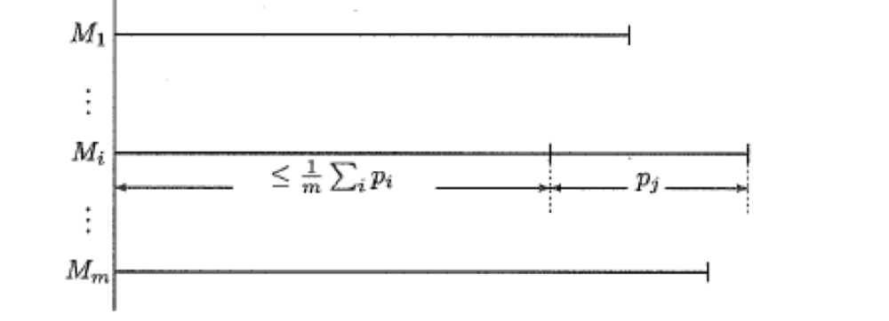
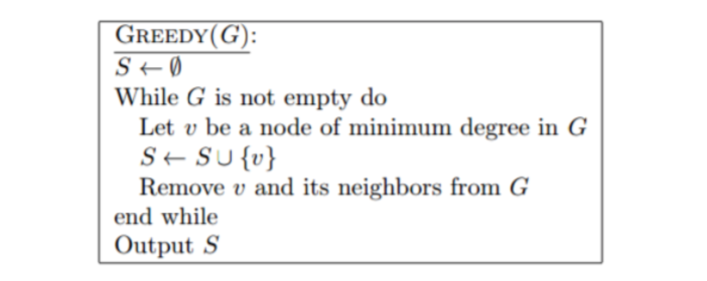
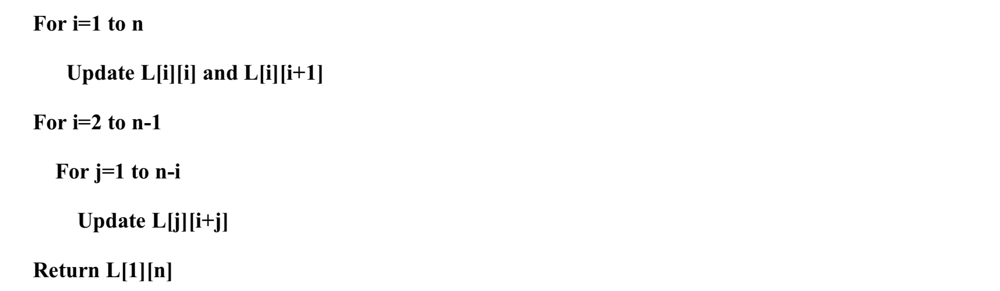
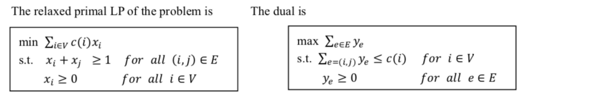
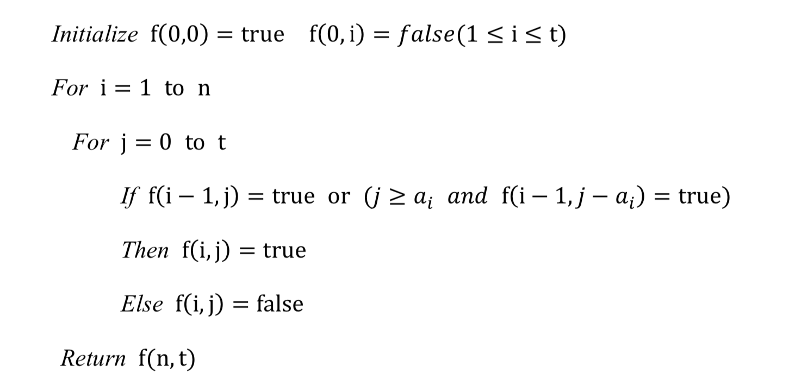

# Examination

# 2014

## 01

### Question

Write the dual to the following linear program. 
$$
Max \quad 6x-4z+7 \\
3x-y \leq 1	\\
4y-z \leq 2 \\
x, y, z \geq 0
$$
Is the solution $(x, y, z)=(\frac{1}{2},\frac{1}{2},0)$ optimal? Write the dual program of the given linear program and 

find out its optimal solution. 

### Solution

为了让结果更清楚，将原问题改写为：
$$
Max \quad 6x+y-4z+7
$$

$$
3x - y + 0z \leq 1 \\
0x + 4y - z \leq 2 \\
x,y,z \geq 0
$$

从而写出我们的dual program：
$$
Min \quad x + 2y + 7
$$

$$
3x + 0y \geq 6 \\
-x + 4y \geq 1 \\
0x-y \geq -4 \\
x,y \geq 0
$$

$(x, y, z)=(\frac{1}{2},\frac{1}{2},0)$是最优解

## 02

### Question

A **Minimum Makespan Scheduling** problem is as follows:

**Input** processing times for 􏰊 jobs $t_1,t_2,…,t_n$ and an integer 􏰏$m$.

**Output** an assignment of the job to $m$􏰏 identical machines so that the completion time is minimized. 

We know that by a greedy approach on the problem, the approximation factor 2. Give a tight example to show the approximation guarantee. 

### Solution

Minimun Makespan Scheduling 算法描述：

**输入**：所需计算时间分别为$t_1$，$t_2$，…，$t_n$的n个任务；m台相同的机器 $m_1, m_2, …, m_n$

**输出**：最少的完成时间。

使用了一个贪心算法解决这个问题，思路是：

1. 随机排列这些job获得一个队列；
2. 依次分配任务1到n，每次选择当前队列时间最短的机器，放入该任务，更新该机器的队列时间。

> 给一下这个算法近似比为2的证明

上述算法的要点在于让机器不要闲着，只要有机器加工完，—就把排在最前面尚待加工的工件让该机器去做。

—算法分析的要点是：**makespan花费的时间取决于最后一个工件的完工时间，在最后一个活开始加工之前，没有机器是空闲的。**

令 $M_i$ 为按照算法最后一个完工工件的机器，令 $J_j$ 为 $M_i$ 上最后完成的工件，令 $Start_j$ 为工件 $J_j$ 在 $M_i$ 上开始加工的时刻，因为算法总是将任务安排给符合最轻的机器，因此，所有机器在 $Start_j$ 前没有空闲。这意味着：
$$
Start_j \leq \frac{1}{m}\sum_it_i\leq OPT
$$
如下图所示：




又因为，$t_j \leq OPT$，因此，算法最后完工时间：
$$
Start_j + t_j \leq 2OPT
$$


一个 tight example 可以是这样一个队列：有 $m^2$ 个计算时间为1的 job，后面跟着一个计算时间为m的job。在这种情况下，使用贪心算法所花费的时间是2m，而最优解所花费的时间是m+1。

## 03

### Question

**Steiner Forest Problem** is defined as follows,

**Input** an undirected graph $G=(V, E)$, nonnegative costs $c_e \geq 0$ for all edges $e∈E$ and $􏰭k$ pairs of vertices $(s_i,t_i)∈V$􏰇􏰮􏰐􏰒*.* 

**Output** a minimum cost subset of edges $F$􏰰 such that every $(s_i,t_i)$􏰒 pair is connected in the set of selected edges. 

Represent the problem as an integer program. 

### Solution

Steiner Forest 问题定义如下：

输入：输入一个无向图 $G=(V,E)$，每条边 $e\in E$ 有非负花费 $c_e \geq 0$，并且有 $k$ 对节点 $(s_i,t_i)\in V$。

输出：一个最小花费的边集合 $F$，且集合中每个 $(s_i,t_i)$ 对都是连接的

首先要注意的是，连接不代表相邻，即如果有 a— b—c，可以说 a c 是相连的。

首先，做如下定义：
$$
r(u,v)=\left\{
\begin{array}{lcl}
1 && if\;\exist\; i\;\;s.t.\;(u,v)=(s_i,t_i) \\
0 && otherwise
\end{array}\right.
$$
意思为对于图上任意两个节点，若这两个节点属于 $k$ 对节点 $(s_i,v_i)$ 中的一个，则结果为1。

然后，让$(S,\bar{S})$ 为 $G$ 的一个cut，定义：
$$
f(S)=\left\{
\begin{array}{lcl}
1 && if\;\exist\; u\in S,v\in \bar{S}\;\;s.t.\;r(u,v)=1 \\
0 && otherwise
\end{array}\right.
$$
于是，得到对应的LP方程：
$$
Min\quad c_ex_e
$$

$$
s.t.\quad \sum_{e:e\in \delta(S)}x_e \geq f(S) \quad S\subseteq V\\
x_e \geq 0 \quad e\in E
$$

其中，$\delta(S)$ 表示 $(S,\bar{S})$ 中所有被分割的边。

## 04

### Question

Given a reduction from the **Clique Problem** to the following problem, which you also need to show to be a search problem.

**Input** a undirected graph *G* and a positive integer $k$.

**Output** a Clique of size $k$ as well as an Independent Set of size $k$, provided both exist.

### Solution

1. 给定一个团的大小k和独立集的大小k，我们可以在多项式时间内验证是否能在图G里找到对应尺寸的团和独立集，所以这是一个搜索问题；

2. 规约过程如下，对于一个图$G=(V,E)$，构造图$G'=(V\cup V',E)$，其中$|V'|=k$。此时，如果 $G'$ 有一个尺寸$k>1$的团，那么这个团中的所有节点一定在集合$V$中。

   **P的输入转化为Q的输入**：P的输入自然就是一个图G和正整数k，Q的输入是图 $G'$ 和正整数k

   **Q的输出转化为P的输出**：如果$G'$有且只有一个尺寸为k的团和尺寸为k的独立集，那么在G中一定也有一个尺寸为k的团，否则$G'$无法构成尺寸为k的团，因为剩下的节点要么属于G，要么是独立集中的节点。

## 05

### Question

Given an undirected graph $G=(V, E)$  in which each node has $degree\leq d$, find an approximation algorithm for maximal independent set with the factor $\frac{1}{d+1}$.

### Solution



算法分析：首先使用这个算法，S肯定是G的一个独立集。接下来考虑一下 $V/S$ 中的节点，通过这种算法，每次从G中选取一个节点 $v$ 到 $S$，最多会删除d个相邻节点（因为每个节点 $degree\leq d$ ），所以：
$$
|V/S| \leq d|S|
$$
又因为：
$$
|S| + |V/S|=|V|
$$
即：
$$
|V/S|=|V| - |S|
$$
联立，得：
$$
|V|-|S| \leq d|S| \\
\therefore |S| \geq \frac{1}{d+1}|V| \geq \frac{1}{d+1}opt
$$

## 06

### Question

A subsequence is **palindromic** if it is the same whether read left to right or right to left. For instance, the sequence 
$$
A,C,G,T,G,T,C,A,A,A,A,T,C,G
$$
has many palindromic subsequences, including $A,C,G,C,A$ and $A,A,A,A$. Devise an algorithm that takes a sequence 􏰀􏰳$x[1,…,n]$􏰊􏰴, and returns the (length of the) longest palindromic subsequence. Its running time should be $O(n^2)$.

### Solution

动态规划方法。时间复杂度 $O(n^2)$，空间复杂度 $O(n^2)$。令$L[i][j]$为 $x[i]$ 到 $x[j]$ 的最大回文字符串

因此可得到动态规划的递归方程：
$$
L[i][j]=\left\{
\begin{array}{lcl}
1 && if\;i=j \\
2&& if\;j=i+1\;and\;x[i]=x[j] \\
max(L[i+1][j],L[i][j-1]) && if\;x[i]=x[j] \\
2+L[i+1][j-1] && o.w.
\end{array}\right.
$$
对应的伪代码为：



从该伪代码易知，算法复杂度为 $O(n^2)$

## 07

### Question

The **Maximum Cut** problem is defined as follows: Given an undirected graph $G=(V,E)$􏰇􏰒,􏰓􏰈 along with a non negative weight $w_{ij} \geq 0$ for each $(i,j) \in E$. The goal is to partition the vertex set into two parts, $U$ and $W=V-U$, so as to maximize the weight of the edges whose two endpoints are in different parts. Give a 2‐approximation randomized algorithm for maximum cut problem.

### Solution

**使用如下算法：**

对于 $V$ 中的每个节点 $v \in V$，它有$\frac{1}{2}$ 的概率被分割至集合$U$

**算法分析：**

令$X_{ij}$为：
$$
X_{ij}=\left\{
\begin{array}{lcl}
0 && 若边不被分割 \\ 
1 && 若边被分割\\
\end{array}\right.
$$
令Z为该分割状态下的权重和，则有：
$$
Z= \sum _{(i,j)\in E}w_{ij}X_{ij}
$$
由于每个节点有$\frac{1}{2}$ 的概率被分割至集合$U$，因此我们这里求的应该是Z的期望，所以：
$$
E(Z)=\sum _{(i,j)\in E}w_{ij}E(X_{ij})=\sum _{(i,j)\in E}w_{ij}Probability[Edge(i,j)\quad in\quad the\quad cut]=\frac{1}{2}\sum _{(i,j)\in E}w_{ij}
$$
令OPT为该图下的最大分割权的最优解。显然，OPT至多为$\sum _{(i,j)\in E}w_{ij}$，故有：
$$
E(Z)=\frac{1}{2}\sum _{(i,j)\in E}w_{ij} \geq \frac{1}{2}OPT
$$
所以，$\frac{OPT}{E(Z)} \leq 2$。

## 08

### Question

The **Weighted Vertex Cover** problem is defined as follows: Given an undirected graph $G=(V,E)$, where $|V|=n$ and $|E|=m$ and a cost function on vertices $c:V \rightarrow Q^+$, find a subset $C \subseteq V$ such that every edge $e \in E$ has at least one endpoint in $C$ and $C$ has a minimum cost. Use the primal‐dual method to give a 2‐approximation algorithm for this problem, and prove the guarantee.

### Solution

题目再描述，问题就是对于一个无向图$G=(V,E)$，有$|V|=n$ 和 $|E|=m$ ，对于每个节点 $\in V$，它都有一个各自的权重值 $c(i)$。问题问的就是找到一个子集 $C \subseteq V$ ，使得对于原图中的每条边 $e \in E$ 都有至少一个点属于集合 $C$，并且权重值 $\sum_{i\in C}c_i$ 为最小。

由题意，易得对应的线性规划和其对偶问题：

其中，$x_i$表示该点是否在集合 $C$ 中，$x_i+x_j\geq1$ 表示至少有一个点在边$(i,j)$ 上。$x_i$ 实际上范围为 $\{0,1\}$。因为这里是表达的是 relaxed primal LP，所以范围为 $x_i\geq0$；$_{(i,j)}y_e$ 表示边 $(i,j)$ 。

> 后续 give up

# 2015

## 02

### Question

Give an $O(n\cdot t)$ algorithm for the following task.

**Input**: A list of $n$ positive integers $a_1,a_2,…a_n$ and a positive integer $t$.

**Question**: Does some subset of the $a_i$'s add up to $t$ ? (You can use each $a_i$ at most once)

### Solution

定义：
$$
f(i,j)=\left\{
\begin{array}{lcl}
true && if\;some\;subset\;of\;a_1,a_2,...,a_i\;add\;up\;to\;j\\ 
false && otherwise\\
\end{array}\right.
$$
故得到动态规划方程组：
$$
f(i,j)=\left\{
\begin{array}{lcl}
true && if\;i=0\;and\;j=0\\ 
true && if\;f(i-1,j)=true\\ 
true && if\;j\geq a_i\;and\;f(i-1,j-a_i)=true\\ 
false && otherwise\\
\end{array}\right.
$$
得到算法：



很明显，该算法时间复杂度为 $O(nt)$

## 03

### Question

In a **facility location problem**, there is a set of facilities and a set of cities, and our job is to choose a subset of facilities to open, and to connect every city to some one of the open facilities. There
is a nonnegative cost $f_j$ for opening facility $j$, and a nonnegative connection cost $c_{i,j}$ for connecting city $i$ to facility $j$. Given these as input, we look for a solution that minimizes the total cost. Formulate this
facility location problem as an integer programming problem.

### Solution

令：
$$
x_j=\left\{
\begin{array}{lcl}
1 && if\;facility\;j\;opens\\ 
0 && if\;not\\
\end{array}\right.
$$

$$
y_{i,j}=\left\{
\begin{array}{lcl}
1 && if\;city\;i\;and\;facility\;j\;is\;connected\\ 
0 && if\;not\\
\end{array}\right.
$$

假设所有的设施为集合 $J$ ，所有的城市为集合 $I$ 。得到如下的线性规划：
$$
Min \quad \sum f_jx_j+\sum c_{i,j}y_{i,j}
$$
另外，必须只有 $x_j$ 为1时 $y_{i,j}$ 才可能为1，因此有如下约束条件：
$$
x_j \geq y_{i,j} \quad for\;i\in I,j\in J
$$
又因为设施$i$至少连着一座城市$j$，故有：
$$
\forall i\in I,\quad\sum_{j\in J} y_{i,j} \geq 1
$$
综上，得到约束条件：
$$
s.t.\;\quad\forall i\in I,j\in J\quad x_j \geq y_{i,j} \\
\qquad\forall i\in I,\quad\sum_{j\in J} y_{i,j} \geq 1 \\
\qquad x \in \{0,1\},\;y\in\{0,1\}
$$

## 05

### Question

You are given an undirected graph. The problem is to remove a minimum number of edges such that the residual graph contains no triangle. i.e., there is no three vertices $a,b,c$ such that edges $(a,b), (b,c), (c,a)$ are all in the residual graph. Give a factor 3 approximation algorithm that runs in polynomial time.

### Solution

**Summary**

基本思想是不断重复的寻找图G中的三角形，找到一个就把对应的三条边全部移除。因为一个对应的最优算法至少需要移除一条边，所以可以说该算法是一个近似比为3的算法。

**Algorithm description**

首先，需要有一个小算法，对于给定的图 $G=(V,E)$，该算法找到一个三角形。假设我们的图 $G$ 存储在邻接矩阵中，并且这个算法会检查任何三个节点 $(u,v,w)$ 是否构成一个三角形。显然，这个小算法的时间复杂度是 $O(n^3)$。当然，这个小算法存在进一步优化。

接下来，整个算法的处理流程如下，当图中有任何三角形时，执行以下步骤：

* 这个三角形是 $(u,v,w)$
* 删除 $G$ 中的 $(u,v),(v,w),(u,w)$

**Explain why it works**

首先很容易看出来，当 $G$ 中没有三角形时，算法结束。接下来要证明这个近似算法是一个近似比为3的近似算法。定义一个 $G$ 的 *triangle-set* ，该集合中是 $G$ 中的一堆无关联的三角形。所谓无关联指的是，该集合中不会有两个三角形有共享边。所以该算法会生成一个  *triangle-set*，每次算法的一个循环，都会移除一个三角形的三条边。进一步的，如果这个图构成的 *triangle-set* 为S，那么整个算法移除的边数必然是 $3|S|$。

让 $OPT$ 是本题的最优解，$OPT$ 里包含的是所有要移除的三角形的边。因为最优算法每个三角形移除的边数至少有一条边，因此 $|OPT| \geq |S|$。而近似算法移除的总边数是 $3|S|$，即 $3|OPT| \geq 3|S|$，即 $3|OPT| \geq 近似算法移除的边数$，因此该算法是一个近似比为3的近似算法。

## 08

### Question

Suppose in a given network, all edges are undirected (or think of every edge as bi-directional with the same capacity), and the length of the longest simple path from the source s to sink t is at most L. Show that the running time of **Edmond‐Karp algorithm** on such networks can be improved to be $O(L \cdot |E|^2)$

### Solution

**Give up**

# 2016

## 01

### Question

Write the dual to the following linear program.
$$
Max \quad \frac{1}{2}x+2y-4 \\
x+y\leq3 \\
\frac{x}{2}+3y\leq5 \\
x,y \geq 0
$$
Find the optimal solutions to both primal and dual LPs.

### Solution

$$
Min \quad 3x+5y-4 \\
s.t. \quad x + \frac{y}{2} \geq \frac{1}{2} \\
\qquad  x + 3y \geq 2 \\
\quad x,y \geq 0
$$

> 用画图的方式得到最优解，或者单纯形法……

原问题：(8/5,7/5) (max = ‐2/5)

对偶问题：(1/5,3/5)(min=‐2/5)

## 02

### Question

Find a polynomial time 4/3‐approximation algorithm for instance of **Metric TSP** where the distances are either 1 or 2.

*Hint:* The 2‐match problem (find a minimum weight subset of edges 􏰀 such that each node is adjacent to exactly 2 edges in 􏰀) can be solved in polynomial time.

### Solution

所谓 2-match problem 是指说对于一个图，找到一个花费最小的边的子集使得图中的每个节点连接2条边（即每个节点的度数为2）

于是本题使用如下算法：

1. 对图 $G=(V,E)$ 使用最小 $2-match$ 算法；
2. 如果得到的结果是唯一一个连通图的，则该结果是所求结果；否则，对于 $k$ 个连通图，每个连通图任选一条边，将其删除，再把它们相连。

先证明这个算法的正确性，对于一个 $2-match$ 算法，每个节点的度数为2。如果连通图个数为1，那么这个结果必为一个TSP的解；如果是 $k$ 个连通图，经过算法处理后，每个节点的度数依旧为2，因此这个结果依旧是一个TSP的解。

当连通图数目为1时，$2-match$ 算法的解即为最佳解，即 $ANS=OPT$

当联通数目为 $k$ 时，因为一个连通图的节点个数最小为3个，所以有 $k\leq\frac{n}{3}$。对于操作，"对于 $k$ 个连通图，每个连通图任选一条边，将其删除，再把它们相连"，因此 $k$ 个连通图会删除 $k$ 条边，并再添加 $k$ 条边。由于每条边的大小为1或2，因此有可能每个删除了 $k$ 条大小为1的边，添加了 $k$ 条大小为2的边，因此至多结果比原来大 $k$。因此，得到：
$$
ANS \leq OPT+k\leq OPT + \frac{n}{3}\leq OPT+ \frac{1}{3}OPT\leq \frac{4}{3}OPT
$$

## 03

### Question

Consider the following algorithm for **Cardinality Vertex Cover**: In each connect component of the input graph execute a **depth first search (DFS)**. Output the nodes that are not leaves in the DFS tree. Show that the output is indeed vertex cover, and that it approximates the minimum vertex cover within a factor of 2.

### Solution

= =……

## 04

### Question

Prove that the **Graph‐Isomorphism problem** is a NP problem.

### Solution

题目是图同构问题，对于同一个图，我们可以用各种不同的形式来描述，这些形式都具有相同数目的边，具有相同数目的顶点，它们有着一一对应的关系，对应的顶点具有相同的连接性。这些图的不同形式，我们称之为图同构。

要证明图同构问题是一个NP问题，只需要根据给出的映射函数 $\phi: V_1 \rightarrow V_2$，验证这个函数 $\phi$ 是否是映射的，并且对于 $(u,v) \in E$ 有且只有 $(\phi(u),\phi(v))\in E_2$

## 05

### Question

**Set Multicover problem** is defined as an extension of **Set Cover problem**, such that each element, $e$, needs to be covered a specified integer number, $r_e$, of times. The objective again is to cover all elements up to their coverage requirements at minimum cost. We will assume that the cost of picking a set $S$ $k$ times is $k \cdot cost(S)$. Represent the problem as an integer linear program. Then relax to a LP and work out its dual.

### Solution

由题意得整数线性方程：
$$
Min\quad\sum_{S_i\in S}cost(S_i)\cdot x_{s_i} \\
subject\;to\quad\forall e_j\in U\quad\sum_{S_i:e_j\in S_i}x_{s_i}\geq r_{e_j} \\
\quad\quad\quad\forall S_i\in S\quad x_{s_i}\in N
$$
这里第一个约束条件的意思是对于所有集合中的元素 $e$，每个元素 $e_j$ 至少出现 $ r_{e_j}$次，$x_{s_i}$ 代表出现集合 $S_i $ 出现的次数，即包含元素 $e_j$ 的集合出现次数总和大于等于 $r_{e_j}$ 次。

易得对应的LP：
$$
Min\quad\sum_{S_i\in S}cost(S_i)\cdot x_{s_i} \\
subject\;to\quad\forall e_j\in U\quad\sum_{S_i:e_j\in S_i}x_{s_i}\geq r_{e_j} \\
\quad\quad\quad\forall S_i\in S\quad x_{s_i}\geq 0
$$
得到对应的对偶问题：
$$
Max \quad \sum_{e_j\in U}y_{e_j}\cdot r_{e_j} \\
subject\;to\quad\forall S_i \in S \quad \sum_{e_j\in S_i}y_{e_j}\leq cost(S_i) \\
\forall e_j \in U \quad y_{e_j} \geq 0
$$

## 06

### Question

Given two strings $x=x_1x_2…x_n$ and $y=y_1y_2…y_m$, we wish to find the length of their longest common substring, that is, the largest $k$ for which there are indices $i$ and $j$ with $x_ix_{i+1}…x_{i+k-1}=y_jy_{j+1}…y_{j+k-1}$. Show how to do this in time $O(mn)$.

### Solution

使用动态规划的思想，如下示例：

|       | F    | I    | S    | H    |
| ----- | ---- | ---- | ---- | ---- |
| **F** | 0    | 0    | 0    | 0    |
| **I** | 0    | 1    | 0    | 0    |
| **S** | 0    | 0    | 2    | 0    |
| **H** | 0    | 0    | 0    | 3    |

$ L[i][j]$ 是 $x_1x_2…x_i$ 和 $y_1y_2…y_j$ 的最长公共子串，满足如下条件：
$$
L[i][j]=\left\{
\begin{array}{lcl}
0 && if \;i=0\;or\;j=0 \\
L[i-1][j-1]+1&& x[i]==y[j] \\
0 && o.w.
\end{array}\right.
$$
对应算法为：

```latex
For i = 1 to n
	L[i][0] = 0
For i = 1 to m
	L[0][i] = 0
For i = 1 to n
	For j = 1 to m
		Update L[i][j]

Return max L[i][j]
```

显然，该算法复杂度为 $O(mn)$

# Sample of Exam

## 01

### Question

In the **Hitting Set** problem, we are given a family of sets $\{S_1,S_2,…,S_n\}$ and a budget $b$ , and we wish to find a set $H$ of size $\leq b$ which intersects every $S_i$ , if such an $H$ exits. In other words, we want $H\cap S_i \neq \varnothing$ for all $i$ .

Show that **Hitting Set** is NP-complete.

### Solution

在碰撞集问题中，给定一组集合${S_1, S_2, S_3, …, S_n}$ 和预算 $b$ ，我们希望求一个与所有$S_i$ 相交且规模不超过$b$ 的集合 $H$（$H$ 与所有$S_i$ 相交不为空）。

只需要验证 $H$ 的大小是否不超过$b$，以及验证$H$ 与$S_i$ 的交不为空，显然可以在多项式时间内得到。

已知图的最小顶点覆盖是一个NP难问题，现将vertex cover 规约到 hitting set：

假设一个图 $G=(V,E)$，令图上的每一条边对应为一个集合 $S_i$，边上的两点即该集合的元素，如 $S_1=\{v_1,v_2\}$，这样以来，就能构造 $|E|$ 个集合。求图 $G$ 的最小顶点覆盖问题，可以转化为求这 $|E|$ 个集合的碰撞集，最小顶点覆盖的顶点就是$H$ 的元素，最小顶点覆盖数即为$b$。 所以碰撞集是一个NP问题且是一个NP难问题，即碰撞集为一个NP完全问题。

## 02

### Question

In a **Feedback Vertex Set Problem** we are given a undirected graph $𝐺 = (𝑉, 𝐸) $ and nonnegative weights $w_𝑣 > 0$ for $𝑣 \in 𝑉$, find a set $𝑆 ⊆ 𝑉$ of minimum weight such that $𝐺[𝑉 \ \backslash 𝑆]$ is a forest. Formulate this facility location problem as an integer linear programming problem, relax it to an LP, and work out its dual.

### Solution

问题再描述，就是对于一个无向图 $G=（V,E)$，每个节点 $v \in V$ 都有一个权重 $w_v$，寻找一个最小权重集合 $𝑆 ⊆ 𝑉$ ，使得 $𝐺[𝑉 \ \backslash 𝑆]$ 是一个森林。

分析一下这个问题，实际上就是要找到这个图中的所有环，然后把这个环中最小权重的那个节点去掉。这样所有构成的节点集合就是我们所需要的最小权重集合。令 $W$ 为图中所有环的集合，$ c_j \in W $ 为图中的一个环。$x_v$ 表示为：
$$
x_v=\left\{
\begin{array}{lcl}
1 && v\;is\;choosen\;to\;delete \\
0 && v\;is\;not \\
\end{array}\right.
$$
得到如下整数线性方程：
$$
Min\quad \sum_{v\in V} w_vx_v\\
\forall c_j\in W,\sum_{v_i: v_i \in c_j}x_i \geq 1 \\
x_i \in \{0,1\}
$$
Relax LP:
$$
Min\quad \sum w_vx_v\\
\forall c_j\in W,\sum_{v_i: v_i \in c_j}x_i \geq 1 \\
x_i \geq 0
$$

DL:
$$
Max\quad \sum_{c_j\in W} y\\
\forall v_i \in V, \sum_{c_j:v_i \in c_j}y_j \leq w_i\\
y_j\geq0
$$


## 03

> 2014年第3题进阶版

### Question

1. 将工件按工时从高到低排列：$t_1 \geq t_2 \geq … \geq t_n$
2. 将工件按照上述顺序分配给机器，将下一个工件安排给当前负荷最轻（剩余加工时间最少）的机器。直到所有工件加工完毕。

### Solution

思路还是和2014年第3题一样的，只是第二部分需要更多的思考。

令 $M_i$ 为按照算法最后一个完工工件的机器，令 $J_j$ 为 $M_i$ 上最后完成的工件，令 $Start_j$ 为工件 $J_j$ 在 $M_i$ 上开始加工的时刻，因为算法总是将任务安排给符合最轻的机器，因此，所有机器在 $Start_j$ 前没有空闲。这意味着：
$$
Start_j \leq \frac{1}{m}\sum_it_i\leq OPT
$$
又因为，$t_j \leq \frac{1}{2}OPT$，证明如下：

假设工件 $m$ 大于处理器 $n$，当 $m=2$，$n=1$ 时，由于工件时间是倒序的，因此一定有 $t_1 \geq t_2$，此时 $OPT=t_1+t_2$，显然 $t_2\leq \frac{1}{2}OPT$。

由数学归纳法也可以推出，当工件为 $m$，处理器数量为 $n$ 且 $m \geq n$ 时，有：
$$
t_j \leq \frac{1}{m}OPT \leq \frac{1}{2}OPT
$$
因此，算法最后完工时间：
$$
Start_j + t_j \leq \frac{3}{2}OPT
$$

## 04

### Question

Consider the following two algorithms for the **knapsack problem**: 

1. The greedy algorithm (pick the item with the best value of $\frac{profit(i)}{size(i)}$);
2. The algorithm that packs the maximum profit item

Prove that the algorithm that picks the better  of these solutions is a $\frac{1}{2}$-approximation for the knapsack problem.

### Solution

背包问题的前提是每件物品只能使用一次，并且任何一件物品不会大到背包装不下。

先考虑贪心策略的情况，相当于把所有物品按性价比从大到小排列，依次选取，假设现在从大到小选取了 $n$ 件物品，那么有：
$$
profit(1)+profit(2)+...+profit(n)\leq OPT
$$
所谓的最优解OPT，一定具有性价比为所有解最高的特点，既然是按性价比从大到小排序，那么在容量不变的前提下，性价比为第（n+1）的商品，这个商品无法放进背包（因为容量不够），但是它总价值一定比OPT高：
$$
\frac{profit(1)+profit(2)+...+profit(n)+profit(n+1)}{Size}> \frac{OPT}{Size}
$$

$$
\therefore\;profit(1)+profit(2)+...+profit(n)+profit(n+1)> OPT
$$

由此，我们可以确定，$profit(1)+profit(2)+...+profit(n)$ 和 $profit(n+1)$至少有一个 $≥\frac{1}{2}$，否则两者之和不可能 $>OPT$。

若是前者总和大于后者，则前者必然大于 $\frac{1}{2}$，则第一种策略 $≥\frac{1}{2}OPT$；若是后者大于前者，则后者必大于$\frac{1}{2}OPT$，在这种情况下，背包问题会选择第二种算法把 $n+1$ 物品放入背包而不是第一种贪心策略，此时第二种策略 $≥\frac{1}{2}$，因此，不管怎么样，必有：
$$
Max\{totalProfit(policy\;1),totalProfit(policy\;2\} \geq \frac{1}{2}OPT
$$

## 05

### Question

Find the dual of the following linear program:
$$
Max \quad 6x_1+8x_2+5x_3+9x_4+5
$$

$$
s.t.\quad2x_1+x_2+x_3+3x_4\geq5\\
\quad\qquad x_1+3x_2+x_3+2x_4=3\\
x_1,x_2\geq0\qquad\quad\;
$$

### Solution

将原问题中的无限制变量进行转换，给不等式添加松弛变量，得到下式：
$$
Max \quad 6x_1+8x_2+5(y_1-y_2)+9(y_3-y_4)+0 \cdot s_1+5
$$

$$
s.t.\quad2x_1+x_2+(y_1-y_2)+3(y_3-y_4)-s_1=5\\
\quad x_1+3x_2+(y_1-y_2)+2(y_3-y_4)=3\\
x_1,x_2,y_1,y_2,y_3,y_4,s_1\geq0 \qquad\qquad\;
$$

故对偶式为：
$$
Min \quad 5w_1+3w_2+5
$$

$$
s.t.\quad 2w_1+w_2 \leq 6 \\
\;\;\;\qquad w_1+3w_2\leq8\\
\qquad\; w_1+w_2\leq5\\
\qquad\quad\;\; -w_1-w_2\leq-5\\
\qquad\quad\; 3w_1+2w_2\leq9\\
\qquad\qquad\;\;-3w_1-2w_2\leq-9\\
\;\;-w_1\leq0
$$

化简得：
$$
Min \quad 5w_1+3w_2+5
$$

$$
s.t.\quad 2w_1+w_2 \leq 6 \\
\;\;\;\qquad w_1+3w_2\leq8\\
\qquad\; w_1+w_2=5\\
\qquad\quad\; 3w_1+2w_2=9\\
w_1\geq0
$$

# Assignment 3

## 04

### Question

Consider the maximum weighted matching problem, where you are given a graph $G = (V, E)$ with nonnegative weights on the edges, and your goal is to find a maximum weight set of edges such that no two edges from the set share a vertex, i.e., they form a matching. It’s known that this problem can be solved exactly in polynomial time. Your task here however, is to give a linear time 2-approximation algorithm.

### Solution

使用贪心算法，算法如下：

1. 将所有边按权重从大到小排序；
2. 每次按权重从大到小依次选取一个两个端点均未被选中的边。

证明如下：

设 $E_{OPT}$ 为 $OPT$ 选取的最优解的边的集合，其权重和为 $OPT$；

设 $E_{Greedy}$ 为贪心算法选取的边的集合，其权重和为 $G$。

对于  $\forall\;(u,v)\in E_{OPT}$ ：

* 若 $(u,v)\in E_{Greedy}$，显然，$w_{OPT_{(u,v)}}=w_{Greedy_{(u,v)}}$；
* 若 $(u,v)\notin E_{Greedy}$，则至少有一个 $(u,x)$ 或 $(y,v)$ $\in E_{Greedy}$，否则 $(u,v)\in E_{Greedy}$ :
  * 若其中一个 $\in E_{Greedy}$，不妨假设 $(u,x)\in E_{Greedy}$，$(y,v)\notin E_{Greedy}$，则 $w_{OPT_{(u,v)}}\leq w_{Greedy_{(u,x)}}$，否则，贪婪算法应该选择边 $(u,v)$；
  * 若两个都 $\in E_{Greedy}$，则 $w_{OPT_{(u,v)}}\leq Max\{w_{Greedy_{(u,x)}},w_{Greedy_{(y,v)}}\}$

综上，对于 $\forall\;(u,v)\in E_{OPT}$，总能找到一个边 $(a,b)\in E_{Greedy}$，且 $ab$ 中至少有一个节点为 $v$ 或者 $u$，使得 $w_{(a,b)} \geq w_{(u,v)}$。由于对于 $(a,b)\in E_{Greedy}$ 中的每条边，对应的结点至多被找到两次，如 $(u,x)\in E_{Greedy}$ 可能被

$(u,v),(x,y)\in E_{OPT}$ 找到，故有：
$$
OPT = \sum_{(u,v)\in E_{OPT}}w_{(u,v)}\leq2\sum_{(a,b)\in E_{Greedy}}w_{(a,b)}=2G
$$

## 06

### Question

Consider a more restricted algorithm than First-Fit, called Next-Fit, which tries to pack the next item only in the most recently started bin. If it does not fit, it is packed in a new bin. Show that this algorithm also achieves factor 2. Give a factor 2 tight example.

### Solution

假设每个箱子的容量为1，$OPT$ 情况下，用了 $m$ 个箱子，每个箱子重 $w_1,w_2,…,w_m$；$Next-Fit$ 情况下，用了 $n$ 个箱子，每个箱子重 $w'_1,w'_2,…,w'_n$。此时有：
$$
w_1+w_2+...+w_m=W_{OPT}=w'_1+w'_2+...+w'_n=W_{Greedy}
$$
由于使用了 Next-Fit 策略，说明只有下一个 item 无法装入当前箱子时，才会开一个新箱子，因此当前箱子与下一个箱子的总重量一定大于一个箱子的容量，即：
$$
w'_i+w'_{i+1} \geq 1
$$
因此，当 $n$ 为偶数时， $n$ 个箱子的总重量一定 $\geq \frac{1}{2}n$，而 $OPT$ 情况下，至多 $m$ 个箱子均为满的，因此 $m\geq W_{OPT}$，所以：
$$
\frac{1}{2}n \leq W_{Greedy}=W_{OPT}\leq m\\
n \leq 2m
$$
当 $n$ 为奇数时，有
$$
\frac{n-1}{2}+w'_n \leq W_{Greedy}=W_{OPT}\leq m \\
\therefore n \leq 2m - (1-w'_n) \\
\because n,m \in N\;\;and\;\;0\leq1-w'_n<1\\
\therefore n \leq 2m
$$
综上，$n\leq2m$，近似比为2，证毕。

## 08

### Question

Given an undirected complete graph, each edge is assigned with a nonnegative cost by the function c. Find a Hamilton cycle with the largest cost by the greedy approach, and prove the guarantee factor is 2.

### Solution

使用如下贪心算法：

找到一个花费最高的边，记为 $(v_1,v_2)$，删除连接 $v_1$ 的所有边，然后作如下循环：

从 $i=2$ 至 $i=n$，找到连接 $v_i$ 的所有边，选择其中花费最高的一条边，记为 $(v_i,v_{i+1})$，删除连接 $v_i$ 的所有边。

最后，连接 $v_nv_1$，得到哈密尔顿环为 $v_nv_1v_2…v_n$。

设最优解为 $u_nu_1u_2…u_n$，对于 $\forall\;u_iu_{i+1}\in OPT $，令 $u_i=v_j,u_{i+1}=v_k$，于是有：
$$
u_iu_{i+1}\leq v_jv_{j+1}\;or\;v_kv_{k+1}
$$
否则，$u_iu_{i+1}$ 会被贪心算法选中为其中一条边，因此，对于 $u_iu_{i+1}\in OPT$，总能找到一条包含其中至少一个节点的边 $v_iv_{i+1} \geq u_iu_{i+1}$。 又因为 $v_i$ 最多被选中两次，一次为入边节点，一次为出边节点，于是有：
$$
\sum u_iu_{i+1} \leq 2\sum v_iv_{i+1}
$$
即 $OPT \leq 2G$

