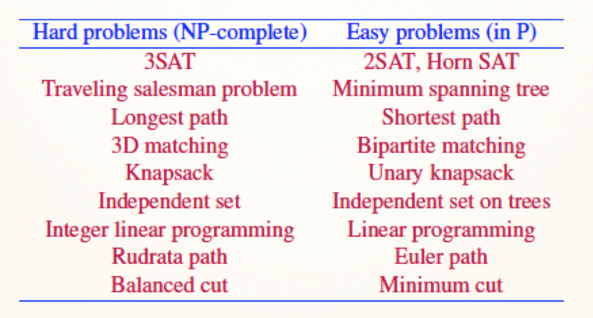
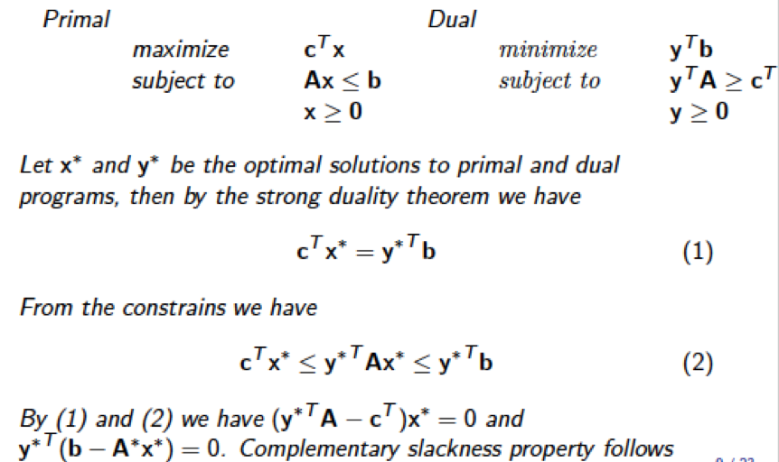

# NP Problem

## Prequirements

### MST

MST，最小生成树。最小生成树要求从一个带权无向完全图中选择n－1条边并使这个图仍然连通(也即得到了一棵生成树)，同时还要考虑使树的权最小。

**Prim 算法**：

1. 首先以一个结点作为最小生成树的初始结点；

2. 然后以迭代的方式找出该最小生成树中各结点权重最小边，并加入到最小生成树中；

3. 加入之后如果产生回路则跳过这条边，选择下一个结点；

4. 当所有结点都加入到最小生成树中之后，就找出了连通图中的最小生成树了。

### 2 - SAT

给定一个布尔方程，判断是否存在一组布尔变量的真值指派使整个方程为真的问题，被称为布尔方程的可满足性问题(SAT)。当有k个变量时，称为 k - SAT 问题，当 k > 2 时，SAT问题是 NPC 问题

### Hamiltonian Cycle

Hamiltonian 问题是一个 NPC 问题。

从图中的任意一点出发，路途中经过图中每一个结点当且仅当一次，则称为哈密顿回路。要满足两个条件：

1. 封闭的环
2. 是一个连通图，且图中任意两点可达

### TSP

TSP，旅行商问题。一个商品推销员要去若干个城市推销商品，该推销员从一个城市出发，需要经过所有城市后，回到出发地。应如何选择行进路线，以使总的行程最短。从图论的角度来看，该问题实质是在一个带权完全无向图中，找一个权值最小的Hamilton回路。

### Euler path

如果图G中的一个路径包括每个边恰好一次，则该路径称为欧拉路径(Euler path)。如果一个回路是欧拉路径，则称为欧拉回路(Euler circuit)。

### Max flow & Min cut

[最小割与最大流](https://blog.csdn.net/a519781181/article/details/51908303)

### 3D Matching

设X，Y，Z为三个有限的，不相交的集合，T为 *X* × *Y* × *Z* 的子集，即 T 中的每一个三元组 (x, y, z) 均有*x* ∈ *X*, *y* ∈ *Y*, and *z* ∈ *Z*。则 *M*（ *M* ⊆ *T* ）为一个3D matching，当任意两个三元组 (*x*1, *y*1, *z*1) ∈ *M* 和 (*x*2, *y*2, *z*2) ∈ *M*，有 *x*1 ≠ *x*2, *y*1 ≠ *y*2, *z*1 ≠ *z*2

### Independent set

从无向图中的顶点中选出k个并且k个顶点之间互不相邻，称这k个点为一个独立集，最大的k就是最大独立集

如上图，这9个蓝色的点就是这个图的最大独立集。

### Maximum Clique Problem, MCP

最大团问题。一个团表示，从无向图的顶点集中选出k个并且k个顶点之间任意两点之间都相邻（完全图），最大的k就是最大团。

如上图右下角，为该7节点图通过某算法找到的最大团。

### Longest Path

[在有向无环图中求最长路径](https://blog.csdn.net/Revivedsun/article/details/51286777)

## Overview

* [P问题、NP问题、NPC问题的概念及实例证明](https://blog.csdn.net/golden1314521/article/details/51470999#%E5%A6%82%E4%BD%95%E5%AF%B9%E9%97%AE%E9%A2%98%E8%AF%81%E6%98%8E)

## Reduction

规约。a -> b,可以高效解答b，则可以高效解答a；反之，a难，b也难

归约主要做的就是以下两个转化（注意两个转化都要在polynomial的时间内完成）【已知PP 是个NP-hard问题，证新问题QQ 亦是NP-hard问题】， 
1. 把P的输入转化到Q的输入； 
2. 把Q的输出转化到P的输出。 

转化的时候：a 比 b 简单或者一样复杂，比如，整数问题转化为实数问题求解，比如，**所有其他的np问题都可以规约到NPC问题**，规约有传递性。

下图展示了上述规约过程。其中 $T_1$ 在多项式时间将 P的输入$P_{input}$ 转化成Q的输入 $Q_{input}$ ; $T_2$ 在多项式时间将 Q的输出 $Q_{output}$ 转化成P的输出 $P_{output}$。也就是说NP-hard问题P可以依赖于对问题Q的解决而解决。那么Q至少比P要难，即P<=Q。

## Steps of proving NPC

1. 首先证明问题是 b 是 np 问题，对于已给的问题，给出一个证书，证明在多项式时间内利用证书可以证明一个Input是yes-input，则问题 b 是 np 问题；

2. 其次证明问题 b 是 npc 问题，首先已知**问题 a 是 npc**，对搜索问题b，如果可以**规约问题a到问题b**，那么问题b也是npc。

> Rudrata cycle 即哈密尔顿环，Rudrata path 即哈密尔顿路径

### Reduction instances

### 3 - SAT  → Independent Set

* [3-SAT to Independent Set](https://zh.coursera.org/lecture/advanced-algorithms-and-complexity/3-sat-to-independent-set-L47nL)

1. 证明独立集是 NP 问题，对于一个独立集S，首先判断是否为V的子集，然后只要在S中任取两点，判断之间没边即可，可以在多项式时间内得到结果，因此它显然是一个NP问题。
2. 规约过程如下图所示：

重点解释一下为什么可以这么规约：

* SAT要求每一个clause（子句）都为真，对应到每一个字句内部，只需要有一个点为真则整个字句均为真，因此，每一个字句一定存在一个节点为真，不选取多余的节点；
* 所谓冲突边表示不能同时选，这是显然的，我不能做到 x 与 x 的非同时为真

3. 这个规约过程加了3m个点，3m+k 条边，花了多项式时间
4. **把P的输入转化到Q的输入**：P的输入是包含m个clause的3SAT表达式；Q的输入当然是转化得到的图形G以及独立集的大小参数g=m
5. **把Q的输出转化到P的输出**：Q的输出是G的一个大小为g的独立集；P的输出是3SAT的一个赋值。假设G中有一个大小为m的独立集，则一定是1)三角形内部三个顶点只能取一个 2)不属于三角形的边所连接的顶点也只取一个。对于每个clause，如果选择了x对应的顶点，则令x=1，如果选择了 $\neg x$对应的顶点，则令$\neg x = 1$，则该赋值是满足3 - SAT问题的。

### SAT  → 3 - SAT

* [SAT规约到3SAT](https://blog.csdn.net/xiazdong/article/details/8258068)
* [SAT to 3-SAT](https://zh.coursera.org/lecture/advanced-algorithms-and-complexity/sat-to-3-sat-S2Uvv)

### Independent Set  → Vertex Cover

**如果 $I$ 是 $G=(V,E)$ 的一个最大独立集，则当且仅当集合 $V-I$ 为 $G$ 的一个最小覆盖。**

证明：

若 $I$ 是一个最大独立集，则 $I$ 中的每个顶点之间没有边，因此 $V-I$ 包含了所有边；

若 $V-I$ 包含了所有边，那么每条边至少包含一个 $V-I $ 中的点，否则$V-I$不是一个最小覆盖，因此 $I$ 一定是一个独立集。

因此 Independent Set  → Vertex Cover 非常简单：
$$
f(G(V,E),b)=(G(V,E),|V|-b)\\
h(S)=V-S
$$
b表示独立集 size 至少为b。

### Independent Set  → Clique

独立集到团的规约非常简单，找到一个独立集 $S$，构造这个独立集的补图 $G'$，则这个补图是个团。

# Linear Programming

## Standard form

* [线性规划的标准型 例2和例3](https://zhuanlan.zhihu.com/p/31729190)

## Duality

考虑如下形式的线性规划问题： 
$$
max\quad c^Tx \\
s.t. Ax \geq b \\
x \geq 0
$$

该问题称为原问题，其相应的对偶问题定义为： 
$$
min\quad y^Tb \\
s.t. y^TA \leq c^T \\
y \geq 0
$$
在原问题和对偶问题中，**b**和**c**的作用是互逆的，这种对偶称为对称形式的对偶。

一个例子：

原LP：
$$
max\quad 3x_1+x_2+2x_3
$$

$$
s.t. \quad x_1+x_2+3x_3\leq30 \\
\quad\quad\quad2x_1+2x_2+5x_3\leq24 \\
\quad\quad4x_1+x_2+2x_3\leq36 \\
x_1,x_2,x_3 \geq 0
$$

则对偶LP为：
$$
min \quad 30y_1+24y_2+36y_3
$$

$$
s.t. \quad y_1 + 2y_2 + 4y_3 \geq 3 \\
\quad\quad y_1 + 2y_2 + y_3 \geq 1 \\
\quad\quad\quad3y_1 + 5y_2 + 2y_3 \geq 2 \\
y_1,y_2,y_3 \geq 0
$$

线性规划对偶问题具有以下性质：

* 对称定理：对偶问题的对偶问题是原问题；
* **弱对偶性**：若 $X_0$ 是原问题的可行解，$Y_0$其对偶问题的可行解，则恒有$CX_0 \leq Y_0b$ ；如果原问题是求极小化问题，上述结论的符号相反$CX_0 \geq Y_0b$
  * **最优判定定理**：若$X_0$为原问题的一个可行解，$Y_0$为对偶问题的一个可行解，若$CX_0 = Y_0b$，则$X_0, Y_0$分别为各自问题的最优解；
  * 推论2：在一对对偶问题中，若其中一个问题可行但目标函数无界，则另一个问题不可行；反之不成立（对偶问题的无界性）；
  * 推论3：在一对对偶问题中，若一个问题可行，另一个问题不可行，则该可行的问题无界。
* **强对偶定理**：线性规划的原问题如果有一个最优解，那么它的对偶问题也有一个最优解，并且这俩最优解的值是一致的。
* **互补松弛定理**：若  和 分别为原问题和对偶问题的可行解，则它们分别是原问题和对偶问题的最优解的充要条件是%3D0)和%3D0) 通过互补松弛定理，给出原问题(对偶问题)的最优解，便可求得其对偶问题(原问题)的最优解。

## Duality theory

**对称形式的对偶**：

原问题为：
$$
Min \quad cx 
$$

$$
s.t.\quad Ax \geq b \\
\qquad x \geq 0
$$

其对偶问题为：
$$
Max \quad wb
$$

$$
s.t.\quad wA \leq c^T \\
\quad\; w\geq 0
$$

其中， $A=m\times n$ 矩阵，$b=(b_1,b_2,…,b_m)^T$ 是 $m$ 维列向量，$c=(c_1,c_2,…,c_n)$ 为 $n$ 维行向量，$x=(x_1,x_2,…,x_n)^T$ 是原问题的变量组成的 $n$ 维列向量，$w=(w_1,w_2,…,w_m)$ 是对偶问题变量组成的 $m$ 维行向量。

*一个例子*：
$$
Min \quad x_1 - x_2
$$

$$
s.t.\quad x_1+x_2\geq5\\
\qquad\quad\; x_1-2x_2\geq1\\
\qquad x_1,x_2\geq0
$$

则其对偶问题为：
$$
Max\quad 5w_1+w_2
$$

$$
s.t.\quad w_1+w_2\leq1\\
\qquad\qquad w_1-2w_2\leq-1\\
\qquad w_1,w_2\geq0
$$

**非对称形式的对偶**：

在上述对称形式的对偶中我们考虑的约束条件为不等式约束条件，这里我们对等式约束条件下的对偶问题称为非对称形式的对偶。但是对偶问题的变换方式和上述类似，只需稍微的变换一下，如下所示。设原问题为：
$$
Min \quad cx
$$

$$
s.t.\quad Ax = b \\
\qquad x \geq 0
$$

这里稍加变换就可以写成**对称形式的等价**为：
$$
Min \quad cx
$$

$$
s.t.\quad Ax \geq b \\
\qquad\qquad -Ax \geq -b \\
\qquad x \geq 0
$$

按照对称形式的策略，此时的对偶问题为：
$$
Max \quad bz_1-bz_2
$$

$$
s.t.\quad z_1A-z_2A\leq c^T \\
\;z_1,z_2\geq0
$$

令 $w=z_1-z_2$ ，**显然w没有非负限制**，于是得到：
$$
Max\quad wb
$$

$$
s.t. \quad wA \leq c^T
$$

*一个例子*：
$$
Min \quad 5x_1+4x_2+3x_3
$$

$$
s.t.\quad x_1+x_2+x_3=4\\
\qquad\quad\;\;3x_1+2x_2+x_3=5\\
\quad x_1,x_2,x_3\geq0
$$

其对偶形式为：
$$
Max\quad4w_1+5w_2
$$

$$
s.t.\quad w_1+3w_2\leq5\\
\;\;\qquad w_1+2w_2\leq 4\\
\qquad w_1+w_2\leq3
$$

关于对偶形式约束条件的不等号方向主要取决于原问题变量的约束条件，当原问题变量 $≥ 0$ 时，对应约束条件不等号为 $≤ $；当原问题变量 $≤ 0$ 时，对应约束条件不等号为 $≥$。

**一般形式的对偶**：

结合等式约束和不等式约束条件的问题就是第三种一般情形，设原问题为：
$$
Min\quad cx
$$

$$
s.t.\quad A_1x\geq b_1\\
\;\;\qquad A_2x=b_2\\
\qquad \;\;A_3x\leq b_3\\
\quad x\geq0
$$

对上述问题进行变换，引入松弛变量得：
$$
Min\quad cx + 0\cdot s_1 + 0\cdot s_2
$$

$$
s.t.\quad A_1x-s_1= b_1\\
\;\;A_2x=b_2\\
\qquad \;\;A_3x+s_2= b_3\\
\qquad x,s_1,s_2\geq0
$$

得到一个非对称形式，有非对称形式规则进行转化得到其对偶方程：
$$
Max\quad b_1w_1+b_2w_2+b_3w_3
$$

$$
s.t.\quad A_1w_1+A_2w_2+A_3w_3 \leq c \\
-w_1 \leq 0 \qquad\qquad\\
w_3 \leq 0 \qquad\qquad\quad\\
$$

即：
$$
Max\quad b_1w_1+b_2w_2+b_3w_3
$$

$$
s.t.\quad A_1w_1+A_2w_2+A_3w_3 \leq c \\
w_1 \geq 0 \qquad\qquad\quad\\
w_3 \leq 0 \qquad\qquad\quad\\
w_2无限制 \qquad\qquad\;\;
$$

如果在原问题，有些变量无限制，比如变量 $y$ 在原问题中范围无限制，则只需要进行 $y=z_1-z_2\;and\;z_1,z_2\geq0$ 的转换即可。

## Classic FPTAS Problem

* [0-1背包问题的动态规划算法](https://zhuanlan.zhihu.com/p/30959069)

令背包容量为 $C$，物品个数为 $I$，$i$ 表示第 $i$ 个物品，$w_i$ 表示第 $i $ 个物品的重量。$m(i,W)$ 表示当限重为 $W$，前 $i$ 个物品下的最大 $Value$ 。这道题的DP方程如下：
$$
m(i,W)=\left\{
\begin{array}{lcl}
0 && if\;i=0 \\
0&& if\;W=0 \\
m(i-1,W)&&if\;w_i>W\\
Max\{m(i-1,W),v_i+m(i-1,W-w_i)\} && otherwise
\end{array}\right.
$$
