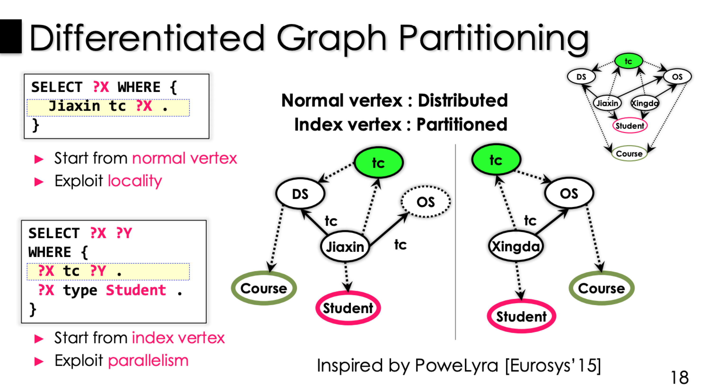
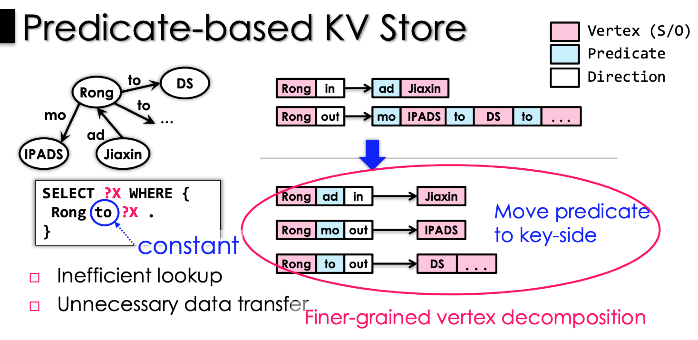

# Graph Query on RDF

* [[OSDI 16] Wukong : 基于RDMA的高并发、快速的分布式RDF Graph Query系统](https://blog.csdn.net/qq_21125183/article/details/80670024)
* [课后习题](https://github.com/gaocegege/csdi-2017-hw/blob/master/week-14.md)

## Overview

RDF图Graph应用场景：通过对大量且不断增长的RDF数据进行大量查询，RDF图形存储库为并发查询处理提供低延迟和高吞吐量势在必行。

现有的工作存在的问题：先前的系统在大数据集上仍然经历高的查询延迟，并且大多数先前的设计具有较差的资源利用率，使得每个查询被顺序地处理。查询处理集中的依赖于潜在大表的连接操作，这通常会产生巨大的冗余中间数据。 此外，使用关系表triplets来存储三元组可能会限制一般性，使得现有系统难以支持RDF数据的一般图形查询，如可达性分析和社区检测。

现有的解决方案：

* 使用triple 存储和 triple join方法。存在的问题：
  * 使用三元组存储会过度依赖Join操作，特别是分布式环境下的merge/hash join操作；
  * scan-join操作会产生大量的中间冗余结果；
  * 尽管现有的工作使用redundant six primary SPO4 permutation index 可以加速join操作，但是索引会导致大量的内存开销。
* 使用Graph store 和 Graph exploration，存在的问题：之前的工作表明，最后一步join相应的子查询结果会造成一个潜在的性能瓶颈。特别是查询那些存在环的语句，或者有很大的中间结果的情况下。

Wukong 是一个**分布式内存 RDF 存储**，针对现有的系统存在的问题，提出了一个可以在查询阶段进行优化中间结果的基于RDMA-Based的RDF Query系统。

## Graph-based Model

Wukong 最大的不同在于索引的存储方式。之前的基于图的设计都是用独立的索引数据结构来存索引，但是 Wukong 是把索引同样当做基本的数据结构（点和边）来存储。并且会考虑分区来存储这些索引。

Wukong中有两种不同类型的索引结构，分别是 Predicate Index和Type Index索引，如下图：

Wukong提出了**谓词索引（P-idx）**来维护所有使用其特定谓词标记的主体和对象入边和出边。索引顶点本质上充当从谓词到相应的主体或对象的倒排索引。Wukong还提出了一种 **Type Index** 索引方便查询一个Subject属于的类型。与先前基于图的方法（使用单独的数据结构管理索引）不同，Wukong将索引作为RDF图的基本部分（顶点和边）处理，同时还考虑了这些索引的分割和存储。

这样做有两个好处，第一点就是在进行图上的遍历或者搜索的时候可以直接从索引的节点开始，不用做额外的操作。第二点是这样使得索引的分布式存储变得非常简单，复用了正常的数据的存储方式。

## Predicate-based KV Store

Wukong 使用了一种基于谓词的键值存储，在这样的结构中，相比原来的存储方式尽管会产生很多的冗余，但这种细粒度的存储使得搜素速率高效许多：

## Query Processing

Wukong 利用图探索通过沿着图特别是根据子图的每个边。对于大多数情况下(谓词通常是知道的恒定变量，然而subject/object是自由变量)，Wukong利用谓词索引开始进行图探索。对于那些查询是一个子图环的查询，三个Subjet/Object都是自由变量。Wukong根据基于cost的方法和一些启发式的选择一个探索顺序。对于一些罕见的情况，那些谓词都是不知道的情况下，Wukong从一个静态的(常量)的顶点进行图形探索（通过pred 已知的顶点相关联的谓词）。

在探索过程中，Wukong 使用了一种 full-history 的修剪，Full-history 就是说所有的历史记录都会被记录下来。之前是只记录一次的。之所以可以这样做是因为一方面 RDF 的查询都不会有太多步，而且 RDMA 在低于 2K bytes 的时候性能都是差不多的，所以 Wukong 可以这样做。

在探索查询的每一个阶段中，通过RDMA READ读取其他机器上的数据，进行裁剪。裁剪那些没有必要的冗余数据。对于一个查询阶段，如果有很少的顶点数据需要抓取从远程机器中，Wukong 使用一个本地执行的模式同步利用单边 RDMA READ 直接从远程顶点抓取数据。对于一个查询阶段，如果许多顶点需要被抓取。Wuong 利用一个 Fork-Join 执行模式异步的分开查询计算到多个子查询在远程机器上。

