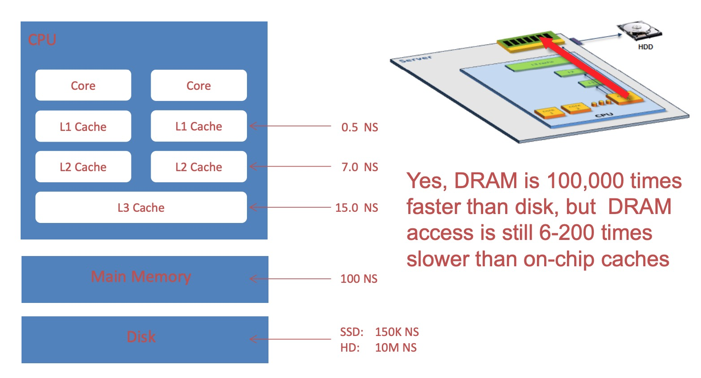
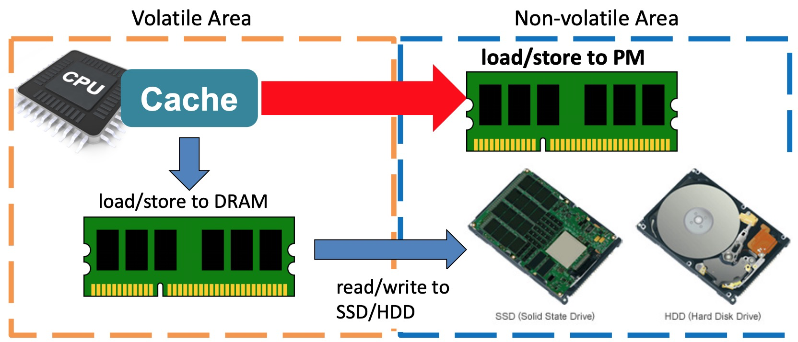
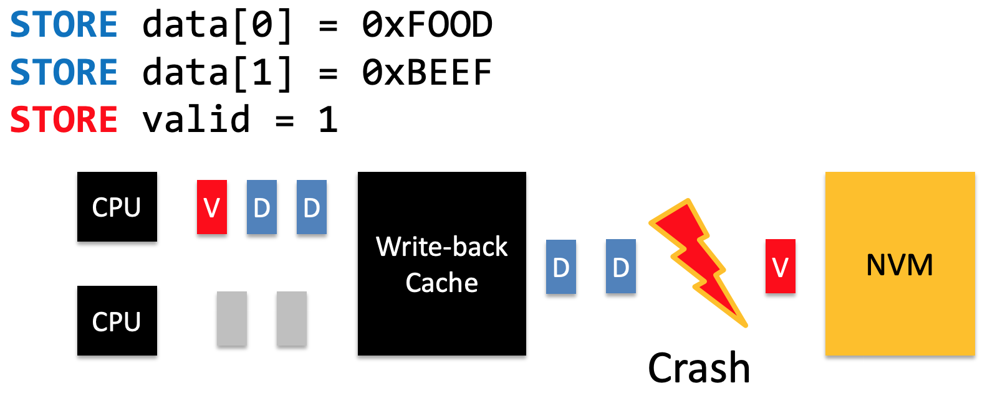
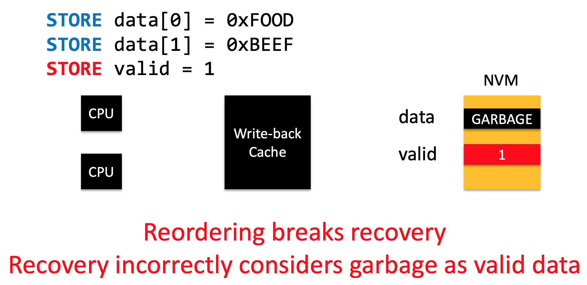

# Non-volatile memory

## Memory Hierarchy

在现在的存储体系结构中，一个显然的事情是，存储的速度越快，价格越贵。所以一个价格曲线是CPU，cache，RAM，Hard Disk和Offline Storage。像DRAM这种内存设备，它可以被CPU直接寻址，所以它是**按字节寻址**的，更物理层面上来说，它是通过总线去访问数据的，因此它很快，但是内存是易失的；像Disk/Flash这种设备，数据具有非易失性，但是相比而言它的存取速度就慢很多，CPU访问硬盘并不是通过总线访问，CPU访问硬盘更像是两个计算机之间的通信。存储设备有一个硬盘控制器，发送命令的时候，还顺便会告诉设备要读多少东西，以及读的东西放到什么内存位置，有了这些信息以后，磁盘控制器会把正确的数据放到指定的位置上，然后CPU就可以访问了，所以Disk/Flash这些是按块寻址的。

> * [32位的cpu只能寻址4GB的内存空间，那么硬盘,flash这些存储设备是如何寻址的的？cpu怎样读取其中某个地址的数据？](https://www.zhihu.com/question/20870045)

这里要讲的NVM这个东西，它的是一个非易失性内存，称为NVM/BPRAM（Byte-addressable,	Persistent	RAM）。它速度快，按字节寻址同时具有非易失性。因此，它应该处于RAM和Cache中间一层。

## Implications on Software

这个NVM对于软件层面会有哪些影响呢？看下图：

原来Jim Gray曾说过："Tape is Dead, Disk is Tape, Flash is Disk, RAM Locality is King"是否可以改成"Tape is Dead, Disk is Tape, Flash is Disk, RAM is Flash, Cache Locality/Pallelism is King"？

## SYSTEM SOFTWARE FOR PERSISTENT MEMORY

但是要应用这个东西还是困难重重，原来cache要访问存储的方法是让DRAM读写SSD/HDD，cache再去读DRAM，现在不需要了，直接读NVM就好了！如下图：

因此需要重新设计一个针对PM的系统（我们当然可以单纯让PM以块设备的方式被访问，但这带来了不必要的开销），这需要考虑两个问题，一个是有序性。

> * [Hardware Support for NVM Programming](http://research.cs.wisc.edu/sonar/tutorial/03-hardware.pdf)

对于cache的写入，它通常是直写和写回，直写（每写入一个数据，cache将数据写入到内存中）简单但是不高效，所以用的都是写回策略（cache miss时，需要更新的块如果为"dirty"，那么写入），可以看下图：

这种方法的好处是高效，坏处是比较复杂，比较在从cache到内存中如果出现电流不稳定产生crash，部分的数据可能就没有完成写入（**现在的架构已经解决了这个问题，但是怎么解决的，我不知道**）

当我们使用一个这个新的架构的时候，也会面临这样的问题：

想要利用现有硬件解决这个问题，需要使用clflush指令。最开始，intel只支持CLFLUSH缓存指令，CLFLUSH的特点是顺序化、串行化的刷新缓存，其缺点是会导致cpu的流水线出现较大的stall时间，导致性能较差。clflushopt和clwb指令是Intel为了支持NVM特地加入的两条优化指令，他们都是用来将CPU多级缓存刷新到NVM中，下面先看看应用程序在向NVM中刷新一条数据时的过程。

首先，数据开始的时候被存储在cpu的多级缓存中，在执行CLFLUSH/CLFLUSHOPT/CLWB缓存刷新指令的时候，缓存中的数据会被刷新到内存控制器的写队列里面WPQ（也就是没有最终写到介质上），因此，理论上如果此时系统掉电，那么将会出现数据丢失的现象。但是在ADR（异步内存刷新）的保证下，即使掉电，写队列里面的数据也会在超级电容的作用下（电容里面存有足够的电量）安全的写到介质上。

> * [Non-volatile memory编程系列之--PMDK概述  基本概念介绍](https://www.liangzl.com/get-article-detail-3823.html)
> * [CPU Cache 原理及操作](https://blog.csdn.net/zhangxizhicn/article/details/6615044)

## PMFS

> * [持久内存的系统软件（System Software for Persistent Memory，Eurosys‘14）](https://blog.csdn.net/xiaorenzhi/article/details/51763136)

PMFS主要围绕三个挑战工作展开：

1. 有序性和持久性；
2. 保护免受流浪写（stray writes）；
3. 如何验证以及判断一致性测试的正确性。

PMFS提出了一个简单的硬件原语为`pm_wbarrier`，它能够保证写PM的顺序性和持久性。

PMFS设计以及实现了：

- 一个轻量级的POSIX文件系统；
- 采用细粒度的日志用于一致性保证；
- 通过透明大页支持将PM直接映射给应用程序；
- 通过低开销机制保护PM免受流浪写影响。

下图是PMFS的体系结构，就是一个B树，PMFS的内存映射就是选择最大的页表。

> * [理解 B 树、B+ 树特点及使用场景](https://juejin.im/entry/5b0cb64e518825157476b4a9)

### Consistency

文件的读写需要保证一致性，有三个现有的技术：

* **COW（copy-on-write）**：主要用来数据区域的更新，Copy-on-write在对数据进行修改的时候，**不会直接在原来的数据位置上进行操作**，而是重新找个位置修改，这样的好处是一旦系统突然断电，重启之后不需要做Fsck。好处就是能**保证数据的完整性，掉电的话容易恢复**。
* **Journaling(logging)**：通过写日志记录操作,根据日志进行恢复,需要执行写日志和写文件两次操作
* **Log-structured updates**: 以日志的形式组织文件系统并执行更新。

> * [What is the difference between a journaling vs a log structured file system?](https://www.quora.com/What-is-the-difference-between-a-journaling-vs-a-log-structured-file-system)