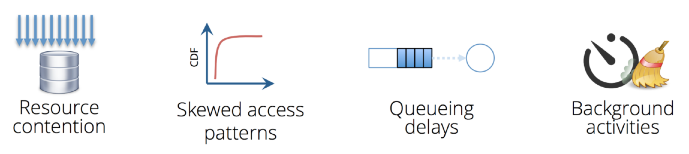
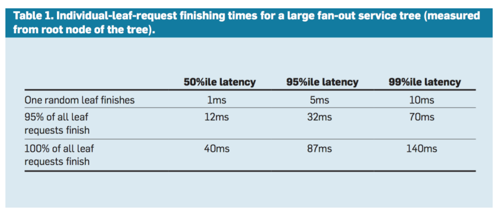

# Tail Latency

* [GitHub notes](https://github.com/Emilio66/CSDI/blob/master/11_Low(Tail)%2Blatency_%E6%9D%8E%E6%98%A5%E6%B7%BC.md)

## Overview

latency 存在在 **CPU和cache间**、**网络上的客户端和服务器间**、**应用和disk间**、**任何系统工作的地方**。想象client向server发送请求，迟迟无响应，表明解决 latency 的重要性。

*降低latency的体现：cache（CPU 和 main memory）、In-memory computation*

latency的出现场景：大数据（关系型->复杂，非结构化）中的查询：Online Search (OLS) 交互式查询和访问数据

数据往往横跨千万台服务器，一些Latency critical 应用：双十一购物online shopping; virtual reality instruments; self- driving car 等

**Latency出现的四大原因：**

- 资源竞争：机器被多应用共享，一些应用竞争共享资源，比如CPU内核，cache，内存和网络带宽等；
- 倾斜的访问模式：一些纪录更容易被访问到，比如社交网络中的热点话题；
- 排队延迟：队头慢影响队尾，队列延迟被放大；
- 后台活动：守护进程被周期性调度，比如一些垃圾回收程序。

一个很关键的问题是，**随着集群规模的提升，延迟会被放大**：

当前在大型的在线服务中减少延迟的一个普遍的技巧就是分配子操作在多台不同的机器上，使其并行执行，并保证每个子操作和它使用的那部分数据会放置在一处。由root把请求fan out到众多的leaf servers，最后再通过request-distribution tree把来自leaf servers的响应merge起来。这些子操作必须都在一个严格的deadline之内完成，来保证service可响应。

然而，在大型分布式环境下，一个组件的延迟在service level就会被放大。如上所述，若每个单独的组件延迟很短时间，把他们整合起来的延迟时间就可能会很长。尤其是一些request的相应必须收集并行的、众多的、带有微小延迟的servers的response的时候，集合起来的性能延迟将是不可忽视的。

如下表所示：

为了降低延迟，一个是从资源的角度：

- 区分服务类型和高级队列
- 减少队首阻塞
- 管理后台活动（同步多台机器上的后台活动）

但是延迟变化是不可避免的，因此容延技巧是必要的。

## Tail-tolerant techniques

容延技巧分为两方面：

* Within request short-term adaptations（几十毫秒级的请求内短期适应）
* Cross request long-term adaptations（几十秒到分钟级的跨请求长期适应）

### Within request short-term adaptations

#### Hedged requests

**Hedged requests**：对冲请求

> We term such requests “hedged requests” because a client first sends one request to the replica 
> believed to be the most appropriate, but then falls back on sending a secondary request after some 
> brief delay. The client cancels remaining outstanding requests once the first result is received.

把同样的request发布给多台有data replica的servers，哪个server 响应最快，就使用这个响应结果。

> defer sending a secondary request until the first  request has been outstanding for more than the 95th-percentile expected latency for this class of requests.

**改进版**：延迟发送第二次请求

**缺点**：hedged-requests technique 中多台服务器可能不必要地执行相同请求。

#### Tied request

Tied request（关联请求）是基于 hedged request 的优化。

Tied request 不是选择把request发送给哪台 server，而是直接把请求同时放置在多台服务器的服务队列上，允许服务器彼此交流这个请求的服务更新状态。

把允许服务器执行跨服务器状态更新的请求称为“tied requests”。最简单的形式就是在发送一个request的同时，绑定发送给其他服务器的编号tag。当一个请求开始执行的时候，就可通过tag告知其他服务器中止执行该请求，其他服务器的服务队列中，如果还有这个request，则直接将其移除或降低优先级。

**缺点**：request在servers的服务队列中延迟 

**改进版**：先探查 remote queues，把请求发送给最低负载的server

**缺点**：在probe和实际request时间之间 load levels 可能发生变化；请求服务的时间难以估计；clients can create hot spots by all picking the same (least-loaded) server。

### Cross request long-term adaptations

Cross request long-term adaptations 主要是通过减少由粗粒度现象引起的延迟变化，静态资源分区通常是不够的。

#### Micro-partitions

微划分。 

* 产生远多于现存机器数的细小的分区；
* 进行动态分配 partitions，保证这些机器上的负载均衡，例如：Tablets in BigTable（ typically each machine managing 20 ~ 1,000 tablets）
* 提升了容错恢复速度
* 一些相似的技术比如 virtual server partition，virtual processor partition。

#### Selective Replication

选择性复制，微划分的加强版。

 预测可能的负载不均衡，创造额外的副本。

例如，Google’s web search system will make additional copies of popular and important documents in multiple micro-partitions

#### Latency-induced Probation

延迟引导的探查。

* 观察不同机器，暂时排除特别慢的机器；
* 对被排除的 servers 继续发送 shadow 请求，一旦发现问题减缓，把这些排除掉的机器再合并进来。

**缺点**：这种方法是违反直觉的，并且，在高负载的情况下，从一个 live system 中移除一个 server 实际上提高了延迟。

### Large Information Retrieval Systems

在大型信息检索系统中，速度是关键的质量度量标准。它有一些处理不精确结果的技巧：

#### Good enough schemes

够好就行。只要有足够数量的sub servers返回结果即可，跳过不必要的子系统提高响应能力（分布式环境下）。

#### Canary Requests

金丝雀请求。在向所有子服务器发送请求之前，先找一两个测试一下，如成功才发送。这种方法提供了额外的安全，但是它会略增加延迟，不过这是值得的，毕竟等待单个或两个服务器响应的变化远小于大规模响应。

### Conclusion

* 即使是罕见的性能问题也会影响大规模分布式系统中所有请求的很大一部分；
* 消除大规模系统中所有延迟可变性的来源是不切实际的，尤其是在共享环境中；
* 使用类似于容错计算的方法，尾容错软件技术从不太可预测的部分形成可预测的整体。