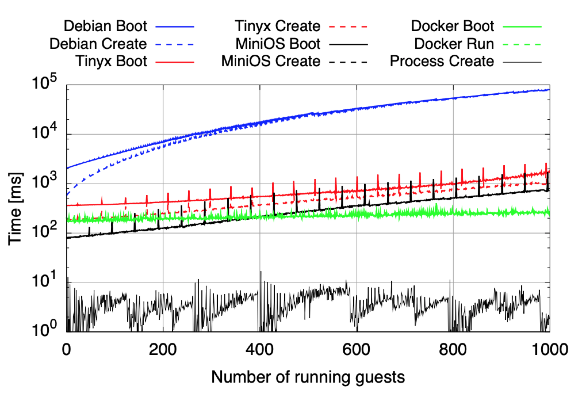
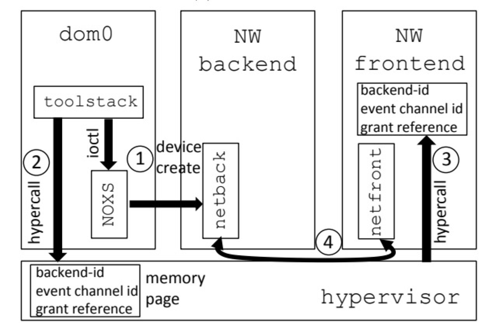

# LightVM

* [原文](http://cnp.neclab.eu/projects/lightvm/lightvm.pdf)
* 相关洞见：
  * [比容器更轻更快的虚拟机（overview）](https://zhuanlan.zhihu.com/p/30594040)
  * [比容器更轻量、更安全的虚拟机（简略版原文翻译）](http://dockone.io/article/3052)
  * [SOSP'17 My VM is Lighter (and Safer) than your Container](https://zhuanlan.zhihu.com/p/30245187)

## Background

尽管容器技术在今天越来越被人接受，但是安全性依然是一个绕不开的问题，由于容器采用的是共享内核外加 cgroups 和 namespaces 等黑魔法的方式进行隔离注定了会有很多路径的 bug 导致隔离性问题，安全隐患依然存在。而不使用虚拟机的原因不外乎虚拟机启动太慢，额外开销太高，性能由于多了一层会下降。面对容器和虚拟机这两个极端，容器一方想把容器做的隔离性更好，虚拟化方面想把虚拟机做的更轻，结果 neclab 的一群人居然做到把**虚拟机的启动速度做的比 Docker 还快，内存开销比 Docker 还小**。（实际上他们主要的工作到不是说我对于这个虚拟机干了什么特别了不起的工作，他们主要的工作在于去改善了XEN，这个后面会提到）

论文的目标是以下三点：

* **Fast Instantiation**：容器以其较小的启动时间而闻名，通常在数百毫秒或更短的范围内。相比之下，虚拟机在几秒或更长时间内的启动时间是臭名昭着的。因此第一点，快速实例化；
* **High Instance Density**：人们常说在一台主机上运行数百甚至多达一千个容器，人们甚至将这个边界推到10,000个容器[17]。 这比VM通常可以实现的要高得多，其最多在数十或数百的范围内，并且通常需要相当强大且昂贵的服务器。第二点，同一台虚拟机可以启动容器级别的实例数量；
* **Pause/unpause**：随着实例化时间的缩短，容器可以快速暂停和取消暂停。 这可以通过暂停空闲实例来实现更高的密度，更一般地，可以更好地利用CPU资源。 例如，亚马逊Lambda“冻结”和“解冻”容器。第三点，允许实例快速暂停和继续运行，那显然，这一点与上述两点互补。

作者调研了基于Xen的虚拟机的性能瓶颈问题。他们在启动大量轻量级虚拟机（都是unikernels和minimal Linux虚拟机）时，发现了性能卡在何处，并且突破了它，创建了一个叫做LightVM的系统。在使用一个最小化的unikernel镜像前提下，这个系统能够在4ms内启动一个虚拟机。作为对比，fork/exec需要消耗将近1ms。在同一个系统中，Docker容器启动需要大概150ms。

产生这些结果的前提是，LightVM的镜像是一个unikernel。论文作者还创建了一个自动化的构建系统，叫做TinyX，它能够用来创建仅运行单个应用的最小化Linux虚拟机镜像。如果我们观察TinyX虚拟机和Docker容器的启动时间，会发现两者的性能在启动250个虚拟机（容器）之前是非常接近的。但一旦过了这个点，Docker的启动时间会比TinyX虚拟机更短，这是因为即便是TinyX创建的最小的Linux发行版也会做一些额外的、临时的后台任务。

## Cut image size to reduce boot time

**随着虚拟机数量的增大，Xen的表现如何呢？如果表现不好，瓶颈又在哪里呢？**

首先他做了一个实验，关于镜像的启动时间，限制虚拟化的可扩展性和性能的最大因素就是虚拟机的大小：

第一种也是最极端的一种 Unikernels。这种方法需要为每个特定应用定制一个特定内核，甚至不好说是给这个应用定制了一个内核，还是定制了一个内核具有一定应用功能。

当然这种方法太极端了，第二种方法就相对温和一些。既然定制 unikernels 太难了，那就拿一个 Linux 内核进行精简化只保留需要的模块和功能，为每个应用编译一个精简化的 Linux 内核，这样就不需要做应用改造了。

为了达到这个目的作者专门做了个 Tinyx 工具，Tinyx主要通过以下几个方法做到削减image大小：

* 使用objdump：objdump命令是用查看目标文件或者可执行的目标文件的构成的gcc工具，可以根据应用 objdump 出来的信息来自动寻找依赖；
* Debian package manager：Tinyx首先有个黑名单，这些包被标记为不是运行应用程序所必需的（主要用于安装，例如dpkg）。然后呢，TinyX不会直接从包中创建镜像，因为包中可能包含一些我不想要的安装脚本，他的思考是在Debian debootstrap system挂载了一个OverlayFS的目录，然后在挂载目录下安装必要的包。在接触挂载前，做一下清理，比如清楚cache啦，一些解压文件和没用的目录，最后覆盖在BusyBox之上构建最小image。

最终的结果是利用 Tinyx 精简内核后镜像大小是 9.5M 的启动时间是 180ms，而 Unikernels 方法镜像大小是 480K，启动时间只需要 3ms。

## Reduce create time

在使用最小内存镜像的情况下，我们来继续观察启动大量虚拟机后，Xen的表现如何。当启动了1000台虚拟机，下图是在同一套硬件上，Debian、TinyX、MiniOS、Docker容器、线程创建的启动（boot）时间和创建（create）时间的对比。

作者对比了进程启动时间，容器启动时间以及一个虚拟机启动的时间。其中进程启动时间作为一个理论上的极限需要 3.5 ms，docker 容器启动时间需要 200ms，而一个 Debian 虚拟机的启动时间需要大约 2s，其中创建 vm 需要 0.5 s， 启动 vm 需要 1.5s。

这些结果令人惊讶，因为所有VM在boot后都处于空闲状态，因此无论VM的数量如何，总系统利用率都应该很低。 从该测试中还可以看出另一个结果：随着VM的大小减小，从创建VM到其可用性所花费的时间越来越大：使用轻量级VM，新VM的实例化成为主要瓶颈。

> 随着虚拟机数量的增加，创建时间急速增长（注意y轴是指数级增长的）：在创建第1000个实例时，Debian、TinyX，unikernel的创建时间分别为42s、10s、700ms。

为了理解这些时间都耗费在哪里，作者监控了Xen的行为和时间，得到了以下这张图：

### Noxs

XenStore交互和设备创建占据了绝大部分时间。其中设备创建的时间相对不变，而XenStore的负载则迅速增长。

我们的目的是使得虚拟机的启动时间能够接近进程启动时间。Xen从没有考虑过这方面的改进，这个问题并不仅仅是不高效的代码造成的。

简单看一下Xen的整个架构：

> 相关阅读：
>
> * [Xen体系结构之一](https://my.oschina.net/daxiong/blog/1938)
> * [Xen虚拟化基本原理详解](https://blog.51cto.com/wzlinux/1727106)

Xen在启动的时候，会自动创建一个叫做Dom0的虚拟机，Dom0运行Linux系统并且托管`toolstack`，这个`toolstack`包含`xl`命令和对应的二进制文件，`toolstack`就像k8s里的`kubectl`，可以进行VM的创建，迁移和关闭。

Dom0还管理着一个`Xenstore`的东西，这个东西是个啥呢，它就像一个注册中心，用于跟踪管理信息，例如正在运行的VM以及有关其设备的信息。

那前面说了，代价主要在device的创建和xenstore上，对吧？为什么会这样呢，首先，xenstore使用的了一个代价很高的协议，每个操作都需要发送消息并接收确认，每个操作都会触发软件中断：单个读取或写入因此触发至少两个；当增加VM的数量时，此协议的负载也会增加。其次，编写某些类型的信息（例如唯一的guest kernel的名字）会导致与机器数量成线性关系，因为XenStore会在接受新guest姓名之前将新条目与所有其他已经运行的guest的名称进行比较。最后，一些信息（例如设备初始化）需要在多个XenStore记录中写入数据，其中通过事务确保原子性。事务本身比较慢，随着负载的增加，属于不同事务的XenStore交互经常重叠，导致需要重试的失败事务。

论文使用了一个noxs去代替xenstore，因为noxs不依赖于消息传递协议，而是依赖于guest虚拟机地址空间中的共享映射，减少了VM操作所需的软件中断和域交叉的数量（创建/保存/恢复/迁移/销毁）。

比如说创建一个新的VM：

我先使用create命令请求从network backend创建一个新设备，这个backend就会返回一个我和这个前端network通信的详细信息，之后toolstack就会把这些信息放进共享内存中，那接下来hypervisor就可以把这写内容映射到对应的地址空间，network frontend拿到这些信息以后就建立了一个通信通道。

### Splite Toolstack

我们展示了与VM创建和其他操作相关的大部分开销来自工具堆栈本身。 经过仔细研究，结果发现，例如，当发出VM create命令时执行的代码的重要部分实际上不需要在VM创建时运行。这是因为此代码对于所有VM是通用的，或者至少对于具有类似配置的所有VM是通用的。例如，VM之间的内存量可能不同，但通常只有少量的内存配置。

为了利用这一点，我们将标准的Xen工具堆替换为libchaos库，并将其分为两个阶段。 准备阶段（参见图8）负责所有虚拟机的通用功能，例如让虚拟机管理程序生成ID和其他管理信息，并为VM分配CPU资源。 我们为chaos守护程序提供了这个功能，它维持了一个预先准备好的虚拟机shell池，通过这个shell池，所有虚拟机的通用处理部分都会在后台进行完成。 守护程序确保系统中始终存在某些（可配置的）shell数量，当一个虚拟机创建命令被发布，一个满足该虚拟机要求的shell会从shell池中被挑选出来，因此只有最终的初始化步骤需要被完成，比如加载内核镜像到内存中，完成设备的初始化。

在标准版的Xen中设备创建会以调用bash脚本来结束，这是一个非常缓慢的过程。LightVM使用了一个二进制后台程序来替换它，这个后台程序会执行一个预定义好的启动程序，这个过程不需要任何forking或者bash脚本。

### Conclusion

Unikernel的内存使用非常接近于Docker镜像，TinyX则需要更多，但1000台虚拟机也只需要22GB内存。这对于当前服务的所有内存来说只是九牛一毛。

只要虚拟机只运行必要的任务，那么虚拟机的CPU占用率也能够接近容器。

