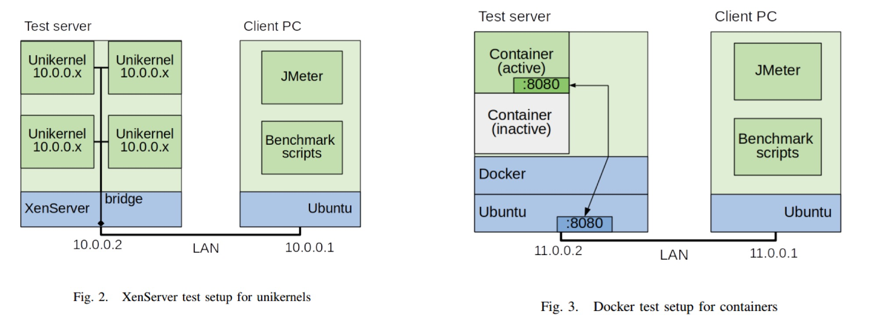

# Unikernel

* [原文](https://www.researchgate.net/publication/329563819_Unikernels_vs_Containers_An_In-Depth_Benchmarking_Study_in_the_Context_of_Microservice_Applications)
* [Unikernel: 从不入门到入门](https://zhuanlan.zhihu.com/p/29053035)
* [谈谈Unikernel](http://blog.sciencenet.cn/blog-1225851-975409.html)

## What‘s unikernel？

从 2014 年以来，容器以一种不可逆转的态势席卷了全球，Unikernel 是很多人眼中的下一个容器。如果要了解什么是 Unikernel，首先需要了解什么是 kernel，kernel 是操作系统中的一个概念。应用要运行起来，是肯定要跟硬件打交道的，但是如果让应用都直接操作硬件，那一定是一场灾难。那内核就是在应用与硬件中间的一层抽象，内核提供了对底层硬件的抽象，比如把硬盘抽象成了文件，通过文件系统进行管理。传统的内核会将所有的硬件抽象都实现在其中，其中的代表就是 Linux，这样的内核被称为宏内核（Monolithic Kernel)。在宏内核中，所有的模块，诸如进程管理，内存管理，文件系统等等都是实现在内核中的。这样虽然不存在通信问题，但是任何一个模块的 bug 会使得整个内核崩溃。

于是学者们提出了微内核（Micro Kernel）的概念，在内核中只保留必要的模块，比如IPC，内存管理，CPU调度等等。而其他，诸如文件系统，网络IO等等，都放在用户态来实现。这样会使得内核不那么容易崩溃，而且内核需要的内存小了。但是由于模块间的通信需要以 IPC 的方式进行，因此有一定的 overhead，效率不如很莽的宏内核。

那后来又有了混合内核（Hybrid Kernel)，把一部分不常使用的内核模块，或者是原本需要的时间就很长，因此 IPC 的 overhead 看起来就不是那么夸张的功能，移出内核，而其他的就会放在内核里。

直接说 Unikernel，[Unikernel 的官方解释](https://link.zhihu.com/?target=http%3A//unikernel.org/)是

> Unikernels are specialised, single-address-space machine images constructed by using library operating systems.

翻译一下就是

> Unikernel 是专用的，单地址空间的，使用 library OS 构建出来的镜像

其最大的卖点就是在，没有用户空间与内核空间之分，只有一个连续的地址空间。这样使得 Unikernel 中只能运行一个应用，而且对于运行的应用而言，没有硬件抽象可言，所有的逻辑，包括应用逻辑和操作硬件的逻辑，都在一个地址空间中。

Unikernel的优势概括起来就是：架构简单、安全高效。

* Unikernel 镜像都很小，由 MirageOS实现的一个 DNS server 才 184KB，实现的一个 web server 674 KB，小到恐怖的程度。首先，Unikernel抹去了现代操作系统由于软件层级抽象而导致的复杂性。越是通用的操作系统（比如Linux或Windows）包含了越多对特定的应用而言并不必要的服务、驱动、依赖包等。譬如USB驱动这类东西在虚拟化的云环境其实是无用的，但在内核运行时仍然会去将它加载进来。这些多余的内容既增加软件运行的负担，又额外消耗了非必须的资源。
* 然后就是快，启动很快。因为镜像都很小，所以起停都在毫秒级别，比传统的 kernel 要快多了。其次，Unikernel消除了运行时内核态与用户态切换的过程。Unikernel的核心驱动与应用程序是同时打包构建的，其内存是单地址空间（single address space），不区分系统内核区域和应用服务区域，因此不论是在启动速度还是在程序执行效率上都远高于通用的服务器操作系统。通常一个Unikernel系统的启动时间都在几十毫秒左右，可以这么说，只需一眨眼功夫，成千上万个服务节点的集群就启动就绪了。
* 最后是安全，一般来讲，小的东西相对而言比较安全。Unikernel 中没有 Shell 可用，没有密码文件，没有多余的设备驱动，这使得 Unikernel 更加安全。一方面，只运行操作系统的核心，抛掉那些可能是漏洞来源的视频、USB驱动、系统进程极大的减小了可攻击的面积。另一方面，对于Unikernel而言，每一个操作系统都是定制用途的，其中包含的核心库均不相同，即使某个服务构建的操作系统由于特定软件问题而遭到入侵，同样的入侵手段在其他的服务中往往不能生效。这无形中增加了攻击者利用系统漏洞的成本。

## Container VS Unikernel

### Overview

对比一下Container和Unikernel：

|                   | Container                                         | Unikernel                              |
| ----------------- | ------------------------------------------------- | -------------------------------------- |
| **Image Size**    | Dozens MB ～ Hundreds MB                          | KB level                               |
| **Boot time**     | Several to dozens seconds                         | Milesecond level                       |
| **Feature**       | Mul containers in one kernel                      | Every process has one build-in kernel  |
| **Environment**   | LXC                                               | Hypervisor                             |
| **Address space** | Isolation with different containers address space | Single address space                   |
| **Process**       | One container can run a set of processes          | Only one process in a unikernel        |
| **Ecosystem**     | Easy to build, mature ecosystem                   | Difficult to build, immature ecosystem |

在Unikernel巨大的性能和安全性优势的背后是其系统构建的繁琐，每次软件的发布都需要经过『编写应用程序』、『选择需要的library』、『将应用程序与系统编译到一起形成系统』这些复杂的重复性操作，其中涉及到许多构建过程中需要的工具和零散的文件。确保每一个开发者都能获取一套能够正确编译出『某个服务的操作系统』的环境其实是一件比较麻烦的事情，而这个事情正是Docker所擅长的。

### Benchmark

测试架构示意图：

在这次测验中，作者对不同语言编写的REST微服务应用分别在Docker和OSv 上进行了测试。测验中对单线程与多线程的测试环境进行了区分，由于unikernel本身特性，多线程的环境下测试结果相较于单线程会有很大差别。

测验主要有以下几个衡量指标：执行耗时，吞吐量，response time，内存消耗量，稳定性。

稳定性测试结果：

* 单核情况下，对于GO语言编写的REST services，每2-10million次请求会产生一次服务进程的崩溃，这可能是语言特性本身的关系。这个比例很低，但要作为一个生产环境仍然比较危险。

* 在多核模式下，每几百万次请求会产生一次崩溃。这些崩溃不是错误导致的，更多情况下是整个unikernel陷入无响应状态，挂起或是停止执行。这可能是整个unikernel在多线程下性能下降的一个原因。

测试结果分析：

| 单线程下                                                     | 多线程下                                                     |
| ------------------------------------------------------------ | ------------------------------------------------------------ |
| Java和Python中unikernel相较于container有16%的性能提升        | Unikernel对多线程多进程的支持还很差                          |
| Go语言中unikernel相较于container有38%的性能提升。            | 在多线程环境下，unikernel的性能要远逊于容器                  |
| 内存消耗方面，由于unikernel 本身还是有kernel部分的overhead，其内存占用还是大于单个容器的。但是考虑到容器之下的操作系统的内存消耗，unikernel的内存消耗还是小于容器的。 | 相较于单线程，多线程环境下只有JAVA有较明显的性能提升，其他语言在unikernel多线程下的性能要比单线程更加糟糕 |

## Cunclusion

可以看到，Unikernel作为容器之后的下一代云技术，确实有着无可比拟的优势，但同时，其本身的局限性和当前研究进度的限制使其距离商用确实还有一定的距离。

目前Unikernel还有以下不足阻碍其商用：

* Unikernel研发代价高，兼容性差；

* 现有Unikernel平台的稳定性有待加强

* Unikernel 的易用性较差(故障->重启，升级->重新编译)

* 对多线程多进程应用的支持较差

* 扩展性与高性能难以兼顾

* 其性能直接受限于hyper

其不足也是未来该领域主要的研究方向，也可以多多关注。
 