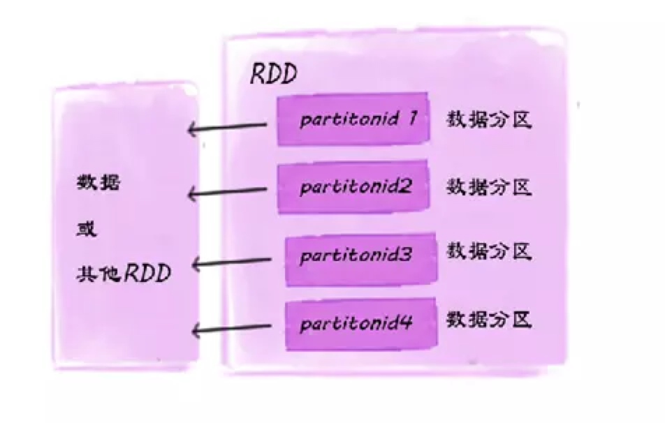
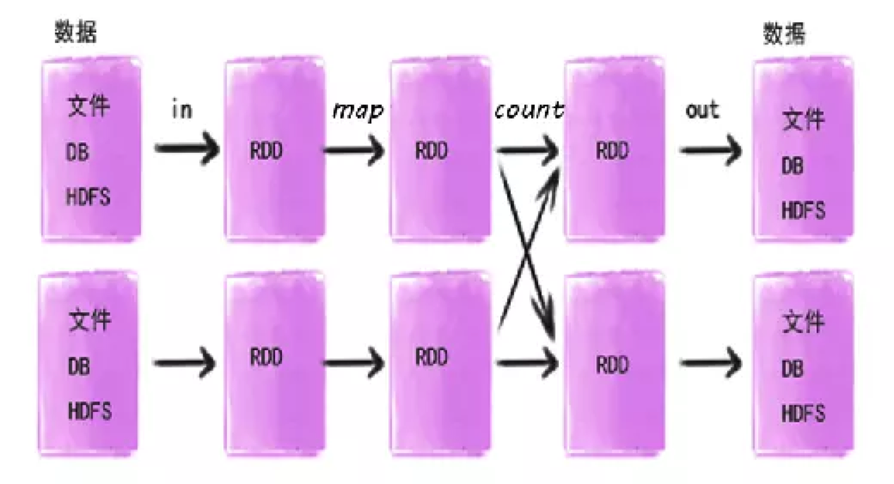
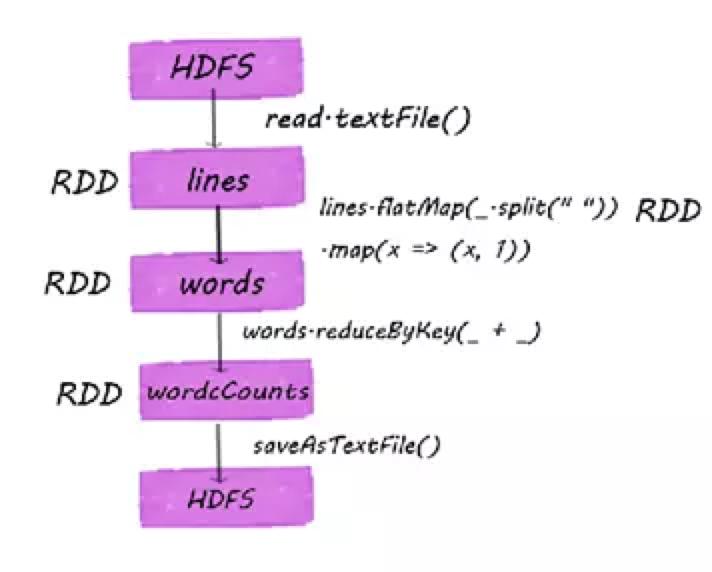
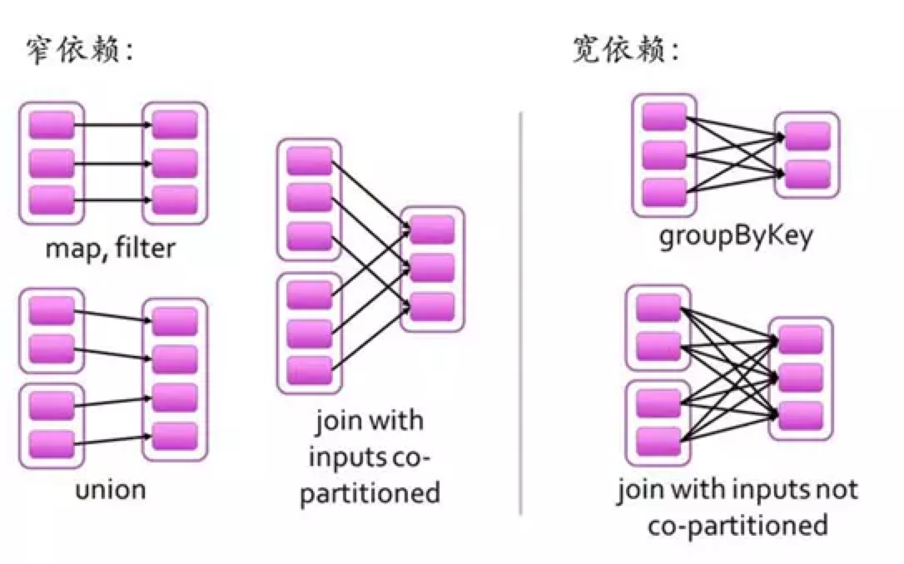
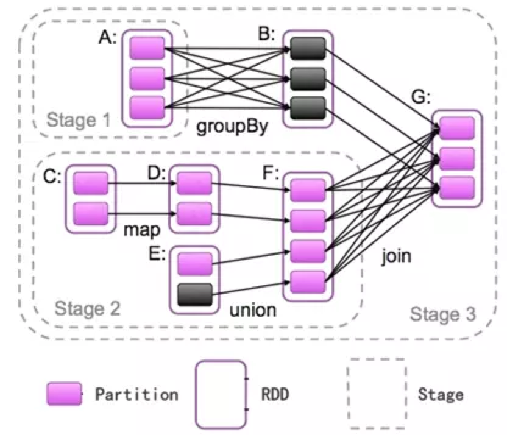
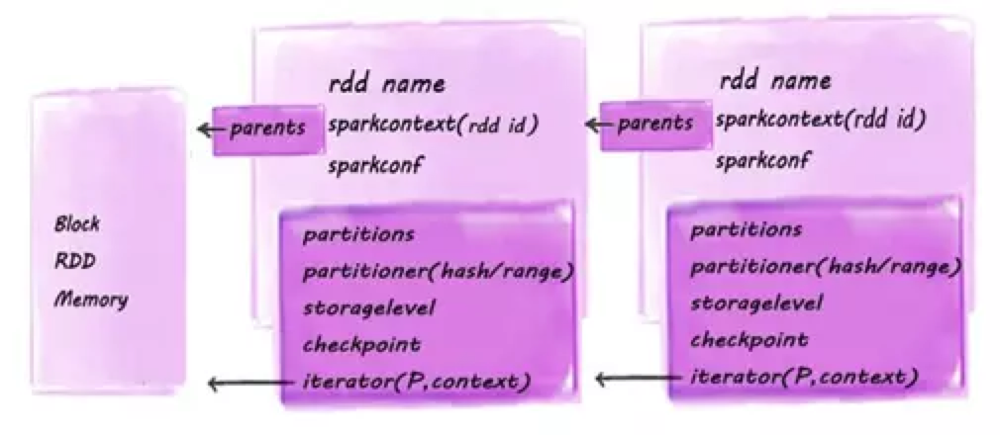
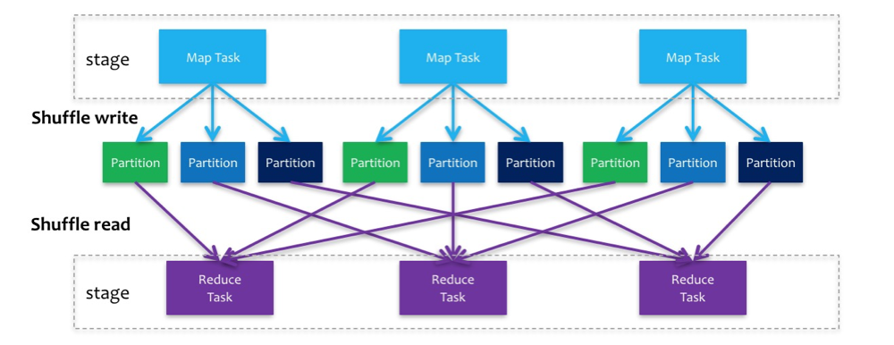

# Spark

- [Resilient Distributed Datasets: A Fault-Tolerant Abstraction for In-Memory Cluster Computing](http://nil.csail.mit.edu/6.824/2018/papers/zaharia-spark.pdf)
- [An Architecture for Fast and General Data Processing on Large Clusters](guide.pdf)

## Background

在了解 Spark 前，需要先仔细了解一下 [MapReduce](../mapreduce.md)。在 Apache Spark 广泛使用以前，业界主要使用 Hadoop MapReduce 来对大数据进行分布式处理，Hadoop MapReduce 存在着这样那样的局限：

- MapReduce 编程模型的表达能力有限，仅靠 MapReduce 难以实现部分算法

- 对分布式内存资源的使用方式有限，使得其难以满足最近大量出现的需要复用中间结果的计算流程，包括：

- - 如迭代式机器学习算法及图算法
  - 交互式数据挖掘

Spark RDD 作为一个**分布式内存资源抽象**便致力于解决 Hadoop MapReduce 的上述问题：

- 通过对分布式集群的内存资源进行抽象，允许程序高效复用已有的中间结果
- 提供比 MapReduce 更灵活的编程模型，兼容更多的高级算法

接下来我们便详细说说 Spark RDD 是如何达成上述目标的。

## RDD Data Model Overview

### What is RDD?

RDD（Resilient Distributed Datasets），是Spark最为核心的概念。从字面上，直译为弹性分布式数据集。所谓“弹性”，一种简单解释是指RDD是横向多分区的，纵向当计算过程中内存不足时可刷写到磁盘等外存上，可与外存做灵活的数据交换；而另一种解释是RDD是由虚拟数据结构组成，并不包含真实数据本体，RDD使用了一种“血统”的容错机制，在结构更新和丢失后可随时根据血统进行数据模型的重建。所谓“分布式”，就是可以分布在多台机器上进行并行计算。

从空间结构上，可以理解为是一组**只读的、可分区的分布式数据集合**，该集合内包含了多个分区。分区就是依照特定规则，将具有相同属性的数据记录放在一起。每个分区相当于一个数据集片段。下图简单表示了一个RDD的结构：



RDD是一个只读的有属性的数据集。属性用来描述当前数据集的状态，数据集是由数据的分区（partition）组成，并（由block）映射成真实数据。RDD属性包括名称、分区类型、父RDD指针、数据本地化、数据依赖关系等，主要属性可以分为3类：

1. 与其他RDD 的关系（parents）
2. 数据(partitioner,checkpoint,storagelevel,iterator)
3. RDD自身属性(rddname,sparkcontext,sparkconf)

### How to create a RDD?

有需要在Spark内计算的数据即形成RDD，所以开始输入到Spark的数据和经过Spark算子（下文介绍算子）计算过的数据都会形成RDD，包括即将输出的数据也会生成RDD后统一输出的。如图：



关于RDD的形成， 主要是通过连接物理存储输入的数据集和在已有RDD基础上进行相关计算操作衍生的。下面我们就通过一个大数据开源生态经典的例子（Wordcount）来描述下RDD的产生过程

```scala
val lines = spark.read.textFile("hdfs://hostname:port/tmp/in.txt").rdd
val words = lines.flatMap(_.split(" ")).map(x => (x,1))
val wordCounts = words.reduceByKey(_ + _)
wordCounts.saveAsTextFile("hdfs://hostname:port/tmp/out")
```

简单解释下这几行代码：

* 第一行，从HDFS上读取in.txt文件，创建了第一个RDD
* 第二行，按空格分词，扁平化处理，生成第二个RDD，每个词计数为1，生成了第三个RDD。这里可能有人会问，为什么生成了两个RDD呢，因为此行代码RDD经过了两次算子转换（transformation）操作。
* 第三行，按每个词分组，累加求和，生成第四个RDD
* 第四行，将Wordcount统计结果输出到HDFS

整个产生过程如下图所示：



### RDD dependency

一个作业从开始到结束的计算过程中产生了多个RDD，RDD之间是彼此相互依赖的，我们把这种父子依赖的关系，称之为 lineage，“血统”。如果父RDD的每个分区最多只能被子RDD的一个分区使用，我们称之为（narrow dependency）窄依赖；若一个父RDD的每个分区可以被子RDD的多个分区使用，我们称之为（wide dependency）宽依赖。简单来讲窄依赖就是父子RDD分区间”一对一“的关系，宽依赖就是”一对多“关系，具体理解可参考下图：



那么为什么 Spark 要将依赖分成这两种呢，下面我们就了解下原因：首先，从计算过程来看，窄依赖是数据以管道方式经一系列计算操作可以运行在了一个集群节点上，如（map、filter等），宽依赖则可能需要将数据通过跨节点传递后运行（如 groupByKey ），有点类似于 MapReduce 的 shuffle 过程。其次，从失败恢复来看，窄依赖的失败恢复起来更高效，因为它只需找到父 RDD 的一个对应分区即可，而且可以在不同节点上并行计算做恢复；宽依赖则牵涉到父 RDD 的多个分区，恢复起来相对复杂些。

综上， 这里引入了一个新的概念 Stage。Stage 可以简单理解为是由一组 RDD 组成的可进行优化的执行计划。如果 RDD 的衍生关系都是窄依赖，则放在同一个 Stage 中运行，若 RDD 的依赖关系为宽依赖，则要划分到不同的 Stage。这样 Spark 在执行作业时，会按照 Stage 的划分, 生成一个完整的最优的执行计划。下面引用一张比较流行的图片辅助大家理解Stage，如图 A 到 B 和 F 到 G 均属于宽依赖，所以与前面的父 RDD 划分到了不同的 Stage 中。


### Job, stage and task

**Job**

Spark 中的数据都是抽象为 RDD 的，它支持两种类型的算子操作：Transformation 和 Action。Transformation算子的代码不会真正被执行。只有当我们的程序里面遇到一个 action 算子的时候，代码才会真正的被执行。

Transformation算子主要包括：map、mapPartitions、flatMap、filter、union、groupByKey、repartition、cache等。

Action算子主要包括：reduce、collect、show、count、foreach、saveAsTextFile等。

**当在程序中遇到一个action算子的时候，就会提交一个job，执行前面的一系列操作**。因此平时要注意，如果声明了数据需要 cache 或者 persist，但在 action 操作前释放掉的话，该数据实际上*并没有被缓存*。

通常一个任务会有多个job，job之间是按照串行的方式执行的。一个job执行完成后，才会起下一个job。**有一段时间曾想让job并行执行，但没有找到解决方法。**

**Stage**

一个 job 通常包含一个或多个 stage。各个 stage 之间按照顺序执行。上面已经说过，一个job会有多个算子操作。这些算子都是将一个父 RDD 转换成子 RDD。这个过程中，会有两种情况：父RDD中的数据是否进入不同的子RDD。如果一个父RDD的数据只进入到一个子RDD，就是我们之前提及的窄依赖。否则，就是宽依赖。

Job 中 stage 的划分就是根据 shuffle 依赖进行的。shuffle依赖是两个stage的分界点。shuffle操作一般都是任务中最耗时耗资源的部分。因为数据可能存放在HDFS不同的节点上，下一个stage的执行首先要去拉取上一个stage的数据（shuffle read操作），保存在自己的节点上，就会增加网络通信和IO。Shuffle操作其实是一个比较复杂的过程。

**Task**

一个 Spark application 提交后，陆续被分解为 job、stage，到这里其实还是一个比较粗的概念。Stage继续往下分解，就是Task。Task 是 Spark 最细的执行单元。**Task的数量其实就是stage的并行度**。

RDD在计算的时候，每个分区都会起一个 task，所以 RDD 的分区数目决定了总的 task 数目。每个 Task 执行的结果就是生成了目标 RDD 的一个 partiton。在 Map 阶段 partition 数目保持不变。在 Reduce 阶段，RDD的聚合会触发 shuffle 操作，聚合后的 RDD 的 partition 数目跟具体操作有关，例如 repartition 操作会聚合成指定分区数。 coalesce 算子同样可以改变 partition 的数目，不过只能减少不能增加。repartition 和 coalesce 算子的区别在于前者会引发 shuffle，后者则不会。

### RDD source code

RDD的内部结构图:



RDD 的属性主要包括（rddname、sparkcontext、sparkconf、parent、dependency、partitioner、checkpoint、storageLevel），逐一了解下：

1. rddname：即rdd的名称
2. sparkcontext：SparkContext 为 Spark job 的入口，由 Spark driver 创建在client端，包括集群连接，RddID，创建抽样，累加器，广播变量等信息。
3. sparkconf：配置信息，即 sc.conf。Spark参数配置信息提供三个位置用来配置系统：
   1. Spark api：控制大部分的应用程序参数，可以用 SparkConf 对象或者 Java 系统属性设置
   2. 环境变量：可以通过每个节点的 conf/spark-env.sh 脚本设置。例如 IP 地址、端口等信息
   3. 日志配置：可以通过 log4j.properties 配置
4. parent：指向依赖父 RDD 的 partition id，利用 dependencies 方法可以查找该 RDD 所依赖的 partiton id 的List 集合，即上图中的 parents。
5. iterator：迭代器，用来查找当前 RDD Partition 与父RDD中 Partition 的血缘关系。并通过 StorageLevel 确定迭代位置，直到确定真实数据的位置。迭代方式分为 checkpoint 迭代和 RDD 迭代， 如果 StorageLevel 为 NONE 则执行 `computeOrReadCheckpoint` 计算并获取数据，此方法也是一个迭代器，迭代 checkpoint 数据存放位置，迭代出口为找到真实数据或内存。如果 Storagelevel 不为空，根据存储级别进入 RDD 迭代器，继续迭代父 RDD 的结构，迭代出口为真实数据或内存。迭代器内部有数据本地化判断，先从本地获取数据，如果没有则远程查找。
6. prisist：rdd 存储的 level，即通过 storagelevel 和是否可覆盖判断，storagelevel分为 5中状态 ，useDisk, useMemory, useOffHeap, deserialized, replication 可组合使用。
7. partitioner 分区方式：RDD的分区方式。RDD的分区方式主要包含两种（Hash和Range），这两种分区类型都是针对K-V类型的数据。如是非K-V类型，则分区为None。 Hash是以key作为分区条件的散列分布，分区数据不连续，极端情况也可能散列到少数几个分区上，导致数据不均等；Range按Key的排序平衡分布，分区内数据连续，大小也相对均等。
8. checkpoint：Spark提供的一种缓存机制，当需要计算的RDD过多时，为了避免重新计算之前的RDD，可以对RDD做checkpoint处理，检查RDD是否被物化或计算，并将结果持久化到磁盘或HDFS。与spark提供的另一种缓存机制cache相比， cache缓存数据由executor管理，当executor消失了，被cache的数据将被清除，RDD重新计算，而checkpoint将数据保存到磁盘或HDFS，job可以从checkpoint点继续计算。
9. storageLevel：一个枚举类型，用来记录RDD的存储级别。存储介质主要包括内存、磁盘和堆外内存，另外还包含是否序列化操作以及副本数量。如：MEMORY_AND_DISK_SER代表数据可以存储在内存和磁盘，并且以序列化的方式存储。是判断数据是否保存磁盘或者内存的条件。
   storagelevel结构：

```scala
 class StorageLevel private(
    private var _useDisk: Boolean,
    private var _useMemory: Boolean,
    private var _useOffHeap: Boolean,
    private var _deserialized: Boolean,
    private var _replication: Int = 1)
```

综上所述Spark RDD和Spark RDD算子组成了计算的基本单位，并由数据流向的依赖关系形成非循环数据流模型（DAG），形成Spark基础计算框架。

## Task Schedule

回顾一下宽窄依赖的最大作用就是把 job 切割成一个个的 stage，那么为什么我们需要把job切割成stage呢？把 job 切割成 stage 之后，stage 内部就可以很容易的划分出一个个的 task 任务（用一条线把 task 内部有关联的子 RDD 与父 RDD 串联起来），然后就可把 task 放到 pipeline 中运行了。

在 Spark 中，任务调度的流程如下：

1. DAGScheduler：根据RDD的宽窄依赖关系将DAG有向无环图切割成一个个的 stage，将 stage 封装给另一个对象 taskSet，`taskSet=stage`，然后将一个个的 taskSet 给 taskScheduler。
2. taskScheduler：taskSeheduler 拿到 taskSet 之后，会遍历这个 taskSet，拿到每一个 task，然后去调用HDFS上的方法，获取数据的位置，根据获得的数据位置分发 task 到响应的 Worker 节点的 Executor 进程中的线程池中执行。
3. taskScheduler：taskScheduler 节点会跟踪每一个 task 的执行情况，若执行失败，taskScheduler 会尝试重新提交，默认会重试提交三次，如果重试三次依然失败，那么这个 task 所在的 stage 失败，此时 taskScheduler 向 DAGScheduler 做汇报。
4. DAGScheduler：接收到 stage 失败的请求后，，此时 DAGSheduler 会重新提交这个失败的 stage，已经成功的 stage 不会重复提交，只会重试这个失败的 stage。（如果DAGScheduler重试了四次依然失败，那么这个job就失败了，job不会重试）

**关于任务调度的几个问题**：

1. stage 中的每一个 task（管道计算模式）会在什么时候落地磁盘？

   1. 如果 stage 后面是跟的是action类算子：
      saveAsText：将每一个管道计算结果写入到指定目录。
      collect：将每一个管道计算结果拉回到Driver端内存中。
      count：将每一个管道计算结果，统计记录数，返回给Driver。
   2. 如果 stage 后面是跟的是 stage：在 shuffle write 阶段会写磁盘。（*为什么在 shuffle write 阶段写入磁盘*？ 防止 reduce task 拉取文件失败，拉取失败后可以直接在磁盘再次拉取shuffle后的数据）

2. Spark在计算的过程中，是不是特别消耗内存？

   不是。Spark是在管道中计算的，而管道中不是特别耗内存。即使有很多管道同时进行，也不是特别耗内存。

3. 什么样的场景最耗内存？

   使用控制类算子的时候耗内存，特别是使用cache时最耗内存。

4. 如果管道中有cache逻辑，他是如何缓存数据的？

   有cache时，会在一个task运行成功时（遇到action类算子时），将这个task的运行结果缓存到内存中

5. RDD（弹性分布式数据集），为什么他不存储数据还叫数据集？
   虽然RDD不具备存储数据的能力，但是他具备操作数据的能力。

6. 如果有1T数据，单机运行需要30分钟，但是使用Saprk计算需要两个小时（4node），为什么？

   1. 发生了计算倾斜。大量数据给少量的task计算。少量数据却分配了大量的task。
   2. 开启了推测执行机制。

7. 对于ETL（数据清洗流程）类型的数据，开启推测执行、重试机制，对于最终的执行结果会不会有影响？

   有影响，最终数据库中会有重复数据。解决方案：

   1. 关闭各种推测、重试机制。
   2. 设置一张事务表。

8. 什么是挣扎（掉队）的任务？

   当所有的task中，75%以上的task都运行成功了，就会每隔一百秒计算一次，计算出目前所有未成功任务执行时间的中位数*1.5，凡是比这个时间长的task都是挣扎的task。

## Resource Schedule


上图解释了当发起一个 application 时，Spark 对于资源的调度步骤：

1. 执行提交命令，会在 client 客户端启动一个 spark-submit 进程（用来为 Driver 申请资源）
2. 为 Driver 向 Master 申请资源，在 Master 的 waitingDrivers 集合中添加这个 Driver 要申请的信息。Master查看 workers 集合，挑选出合适的 Worker 节点
3. 在选中的 Worker 节点启动 Driver 进程（ Driver 进程已经启动了，spark-submit 的使命已经完成了，关闭该进程）
4. Driver 进程为要运行的 Application 申请资源（这个资源指的是 Executor 进程）。此时 Master 的waitingApps 中要添加这个 Application 申请的资源信息。这时要根据申请资源的要求去计算查看需要用到哪些 Worker 节点（每一个节点要用多少资源）。在这些节点启动 Executor 进程（轮询启动 Executor。Executor 默认占用这个节点1G内存和这个 Worker 所能管理的所有的 core）

5、此时 Driver 就可以分发任务到各个 Worker 节点的 Executor 进程中运行了。

默认情况下，Executor的启动方式是**轮询启动**，一定程度上有利于数据的本地化。

所谓轮询启动：轮询启动就是一个个的启动。例如这里有5个人，每个人要发一个苹果+一个香蕉。轮询启动的分发思路就是：五个人先一人分一个苹果，分发完苹果再分发香蕉。

为什么要使用轮询启动的方式呢？做大数据计算首先肯定想的是计算找数据。在数据存放的地方直接计算，而不是把数据搬过来再计算。我们有 n 台 Worker 节点，如果只是在数据存放的节点计算。只用了几台 Worker 去计算，大部分的worker都是闲置的。这种方案肯定不可行。所以我们就使用轮询方式启动Executor，先在每一台节点都允许一个任务。

存放数据的节点由于不需要网络传输数据，所以肯定速度快，执行的 task 数量就会比较多。这样不会浪费集群资源。

Spark 在调度的时候使用**粗粒度调度**，在任务执行之前，会先将资源申请完毕，当所有的 task 执行完毕，才会释放这部分资源。这样的优点是每一个 task 执行前。不需要自己去申请资源了，节省启动时间。但缺点是等到所有的 task 执行完才会释放资源，集群的资源就无法充分利用。

MapReduce 的调度使用**细粒度调度**，Application提交的时候，每一个task自己去申请资源，task申请到资源才会执行，执行完这个task会立刻释放资源。这样的优点是每一个task执行完毕之后会立刻释放资源，有利于充分利用资源。但缺点是由于需要每一个 task 自己去申请资源，导致 task 启动时间过长，进而导致 stage、job、application 启动时间延长。
## Schedule Process

本节将任务调度与资源调度相结合，仔细看看 Spark 是如何调度的：


步骤：

1. 启动 Master 和备用 Master（如果是高可用集群需要启动备用 Master，否则没有备用 Master）
2. 启动 Worker 节点。Worker 节点启动成功后会向 Master 注册。在 Works 集合中添加自身信息
3. 在客户端提交 Application，启动 spark-submit 进程。伪代码：`spark-submit --master --deploy-mode cluster --class jarPath`
4. Client 向 Master 为 Driver 申请资源。申请信息到达 Master 后在 Master 的 waitingDrivers 集合中添加该Driver 的申请信息。
5. 当 waitingDrivers 集合不为空，调用 `schedule()` 方法，Master 查找 works 集合，在符合条件的 Work 节点启动 Driver。启动 Driver 成功后，waitingDrivers 集合中的该条申请信息移除。Client 客户端的 spark-submit 进程关闭。（Driver启动成功后，会创建 DAGScheduler 对象和 TaskSchedule 对象）
6. 当 TaskScheduler 创建成功后，会向 Master 会 Application 申请资源。申请请求发送到 Master 端后会在 waitingApps 集合中添加该申请信息
7. 当 waitingApps 集合中的元素发生改变，会调用 `schedule()` 方法。查找 works 集合，在符合要求的 worker 节点启动 Executor 进程
8. 当 Executor 进程启动成功后会将 waitingApps 集合中的该申请信息移除。并且向 TaskSchedule 反向注册。此时 TaskSchedule 就有一批 Executor 的列表信息
9. 根据 RDD 的宽窄依赖，切割 job，划分 stage。每一个 stage 是由一组task组成的。每一个 task 是一个pipleline 计算模式
10. TaskScheduler 会根据数据位置分发 task。（*taskScheduler 是如何拿到数据位置的？*TaskSchedule 调用 HDFS 的 api，拿到数据的 block 块以及 block 块的位置信息）
11. TaskSchedule 分发 task 并且监控 task 的执行情况
12. 若 task 执行失败或者挣扎。会重试这个 task。默认会重试三次
13. 若重试三次依旧失败。会把这个 task 返回给 DAGScheduler，DAGScheduler 会重试这个失败的 stage（只重试失败的这个 stage）,默认重试四次
14. 告诉 master，将集群中的 executor 杀死，释放资源。

其中，前8步为资源调度，后6步为任务调度。

## Spark Shuffle

与MapReduce计算框架一样，Spark的Shuffle实现大致如下图所示，在DAG阶段以shuffle为界，划分stage，上游stage做map task，每个map task将计算结果数据分成多份，每一份对应到下游stage的每个partition中，并将其临时写到磁盘，该过程叫做shuffle write；下游stage做reduce task，每个reduce task通过网络拉取上游stage中所有map task的指定分区结果数据，该过程叫做shuffle read，最后完成reduce的业务逻辑。举个栗子，假如上游stage有100个map task，下游stage有1000个reduce task，那么这100个map task中每个map task都会得到1000份数据，而1000个reduce task中的每个reduce task都会拉取上游100个map task对应的那份数据，即第一个reduce task会拉取所有map task结果数据的第一份，以此类推。



在map阶段，除了map的业务逻辑外，还有shuffle write的过程，这个过程涉及到序列化、磁盘IO等耗时操作；在reduce阶段，除了reduce的业务逻辑外，还有前面shuffle read过程，这个过程涉及到网络IO、反序列化等耗时操作。**所以整个shuffle过程是极其昂贵的**，spark在shuffle的实现上也做了很多优化改进，随着版本的迭代发布，spark shuffle的实现也逐步得到改进。[Spark Shuffle 原理及相关调优](http://sharkdtu.com/posts/spark-shuffle.html)详细介绍spark shuffle的实现演进过程。

## Reference

* [RDD的数据结构模型](https://www.jianshu.com/p/dd7c7243e7f9?from=singlemessage)
* [理解 spark 中的 job、stage、task](https://zhuanlan.zhihu.com/p/50752866)
* [Spark的任务调度](https://blog.csdn.net/qq_33247435/article/details/83687361)
* [Spark的资源调度](https://blog.csdn.net/qq_33247435/article/details/83894967)
* [Spark的调度流程](https://blog.csdn.net/qq_33247435/article/details/83960291)
* [Spark Shuffle](https://blog.csdn.net/qq_33247435/article/details/84140659)
* [Spark Shuffle原理及相关调优](http://sharkdtu.com/posts/spark-shuffle.html)


[返回目录](../../README.md)

